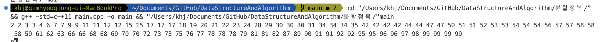
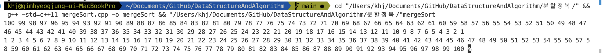

# TEAM Algorithm
ktc동아리 알고리즘 팀 김혁중

## 🕰️ 발표날짜 : 1월 22일 월요일

## 🖥️ 분할정복 소개
분할 정복(Divide and Conquer)은 여러 알고리즘의 기본이 되는 해결방법으로, 기본적으로는 엄청나게 크고 방대한 문제를 조금씩 조금씩 나눠가면서 용이하게 풀 수 있는 문제 단위로 나눈 다음 그것들을 다시 합쳐서 해결하자는 개념에서 출발하였다


## ⏳ 여러 형태의 시간복잡도
- NP
- EXPTIME
- PSPACE

## 1️⃣ 특정 값을 검색하기
정렬된 목록에서 특정 값을 검색할 때
1.	시퀀스 전체 원소를 방문하면서 해당 원소가 N과 같은지를 확인하는 것
이는 입력시퀀스의 정렬여부와 상관없이 항상 잘 작동한다. 하지만 시간 복잡도가 O(n)며 주어진 배열이 정렬되어 있다는 것을 이용하지 않는다. 
2.	이진 검색을 사용한다. 이진 검색은 정렬된 시퀀스에 대해서 가운데 원소와 찾고자 하는 값을 비교한 뒤 그 원소가 존재할 수 있는 작은 부분으로 축소하여 앞에 작업을 반복한다.


---
### 🧑‍🏭 이진 검색의 예

**주어진 배열, 찾으려는 값 : 9**

| 1 | 2 | 3 | 4 | 5 | 6 | 7 | 8 | 9 |
| --- | --- | --- | --- | --- | --- | --- | --- | --- |


1️⃣ **주어진 배열에서 중앙값을 찾는다.**

| 1 | 2 | 3 | 4 | <span style="color:red"><p>5</p><em></span> | 6 | 7 | 8 | 9 |
| --- | --- | --- | --- | --- | --- | --- | --- | --- |


2️⃣ **중앙값과 찾으려는 값을 비교하여 찾으려는 값이 크다면 범위를 좁혀서 1번을 반복한다.**

| 1 | 2 | 3 | 4 | <span style="color:red"><p>5</p><em></span> | 6 | 7 | 8 | 9 |
| --- | --- | --- | --- | --- | --- | --- | --- | --- |

3️⃣ **6에서 9사이의 수 중에서 중앙값을 찾아 9와 비교한다**

| 1 | 2 | 3 | 4 | 5 | <span style="color:blue">6</span> | <span style="color:red"><p>7</p><em></span> | <span style="color:blue">8</span> |<span style="color:blue">9</span> |
| --- | --- | --- | --- | --- | --- | --- | --- | --- |

4️⃣ **찾으려는 값이 7보다 크므로 8과 9로 범위를 좁혀서 1번을 반복한다**

| 1 | 2 | 3 | 4 | 5 | 6 | 7 | <span style="color: blue"><p>8</p></span> | <span style="color: blue">9</span> |
| --- | --- | --- | --- | --- | --- | --- | --- | --- |

5️⃣ **8보다 9가 크므로 범위를 좁혀 9부터 9까지의 중앙값과 9를 비교한다**

중앙값이 9이므로 값이 같아 검색을 성공한다.
| 1 | 2 | 3 | 4 | 5 | 6 | 7 | 8 | <span style="color: blue"><p>9</p></span> |
| --- | --- | --- | --- | --- | --- | --- | --- | --- |


## 👨‍💻 이진탐색 수도코드
```C++
BinarySearch(A[0..N-1], value, p, r) {
  if (p < r)
    return -1
  q = (p + r) / 2 // 중간 요소 설정(floor)
  if (A[q] > value)
    return BinarySearch(A, value, p, q - 1) //[low, mid)
  else if (A[q] < value)
    return BinarySearch(A, value, q + 1, r) // (mid, high)
  else
    return q
}
```

## 🎱 이진탐색 구현
```cpp
#include <iostream>
#include <vector>
#include <chrono>
#include <random>
#include <algorithm>
#include <ctime>

bool linear_search(int n, std::vector<int>& s) {
    for(auto i : s) {
        if(i == n) {
            return true;
        }
    }
    
    return false;
}

bool binarySearchRecursive(int n, int st, int end, std::vector<int>& s) {
    if(st > end) {
        return false;
    } else {
        int mid = (st + end) / 2;
        if(n == s[mid]) {
            return true;
        } else if(n < s[mid])  {
            return binarySearchRecursive(n, st, mid - 1, s);
        } else {///}(n > s[i])
            return binarySearchRecursive(n, mid + 1, end, s);
        }
    }
}

bool binarySearch(int N, std::vector<int>& s) {
    return binarySearchRecursive(N, 0, int(s.size()) - 1, s);
}

int main(void) {
    srand(unsigned(time(0)));
    using namespace std;
    
    vector<int> a(100);
    generate(a.begin(), a.end(), []() {
        return rand() % 100;
    });
    sort(a.begin(), a.end());
    
    for(auto i : a) {
        cout << i << " ";
    }
    cout << '\n';
    cout << binarySearch(10, a);
    
    
    
    
    return 0;
}

```
### 출력결과


## 2️⃣ 분할정복을 이용하여 정렬하기
효율적인 정렬알고리즘은 매우 중요하다.
데이터를 정렬해 놓으면 로그 함수 시간복잡도로 저장된 데이터에 접근가능하다.
이를 분할정복을 이용하여 구현할 것이다.

정렬알고리즘의 요구사항


1. 모든 데이터 타입에 대해서 작동해야한다. (서로 다른 구조체를 멤버기준으로 정렬이 가능해야한다.)
2. 많은 양의 데이터를 처리할 수 있어야한다.
3. 정렬알고리즘은 점근적 시간복잡도 측면이나 실제 동작시에 빠르게 동작해야한다.


---

### 🍔 병합정렬
병합정렬은 많은 원소로 구성된 전체 집합을 작은 크기의 부분집합으로 나눠 각각을 정렬하고, 정렬된 부분집합을 오름차순 또는 내림차순 순서를 유지하면서 합치는 방식이다.

### 🐬 병합정렬 수도코드
```cpp
mergeSort(A[], p, r) {
    if(p < r) {
        q <- [(p+r)/2] ///p와 r의 중간 지점 계산
        mergeSort(A, p, q) ///q기준으로 전반부 정렬
        mergeSort(A, q + 1, r) ///q기준으로 후반부 정렬
        merge(A, p, q, r) ///병합
    }
}

merge(A[], p, q, r) {
    정렬된 두 리스트 A[p...q]와 A[q + 1... r]을 합쳐
    정렬된 하나의 A[p...r]을 만든다.
}
```

### ⭐ 병합정렬 예시(수도코드)
**주어진 배열**

| 2 | 6 | 7 | 3 | 1 | 9 | 5 | 4 | 8 |
| --- | --- | --- | --- | --- | --- | --- | --- | --- |

1️⃣ 중간지점 계산 -> 1, 1을 기준으로 왼쪽 오른쪽 정렬 후 병합
| 2 | 6 | 7 | 3 | 1 | 9 | 5 | 4 | 8 |
| --- | --- | --- | --- | --- | --- | --- | --- | --- |


| <span style="color:blue">1</span> | <span style="color:blue">2</span> | <span style="color:blue">3</span> | <span style="color:blue">6</span> | <span style="color:blue">7</span> | <span style="color:red"><p>4</p><em></span> | <span style="color:red"><p>5</p><em></span> | <span style="color:red"><p>8</p><em></span> | <span style="color:red"><p>9</p><em></span> |
| --- | --- | --- | --- | --- | --- | --- | --- | --- |


2️⃣ 두 배열을 순서대로 병합
| 1 | 2 | 3 | 4 | 5 | 6 | 7 | 8 | 9 |
| --- | --- | --- | --- | --- | --- | --- | --- | --- |


### 🏀 병합정렬 수도코드 구체화
```cpp
#include <iostream>
#include <vector>
#include <algorithm>

void merge(int st, int mi, int end, std::vector<int>& v) {
    std::vector<int> tmp(end - st + 1);
    int i = st;
    int j = mi + 1;
    int t = 0;
    
    while(i <= mi && j <= end) {
        if(v[i] <= v[j]) {
            tmp[t++] = v[i++];
        } else {
            tmp[t++] = v[j++];
        }
    }
    
    while(i <= mi) {
        tmp[t++] = v[i++];
    }
    
    while(j <= end) {
        tmp[t++] = v[j++];
    }
    
    t = 0;
    for(int i = st; i <= end; i++) {
        v[i] = tmp[t++];
    }
}

void mergeSort(int st, int end, std::vector<int>& v) {
    if(st < end) {
        int mid = (st + end) / 2;
        mergeSort(st, mid, v);
        mergeSort(mid + 1, end, v);
        merge(st, mid, end, v);
    }
}


int main(void) {
    using namespace std;
    
    vector<int> v(100);
    int i = 100;
    generate(v.begin(), v.end(), [&i]() {
        return i--;
    });
    
    
    for(auto a : v) {
        std::cout << a << " ";
    }
    
    std::cout << '\n';
    
    mergeSort(0, int(v.size()) - 1, v);
    
    for(auto a : v) {
        std::cout << a << " ";
    }
    
    return 0;
}

```
### 출력


### 🏈 병합정렬 예시(실제 코드)

1️⃣ 주어진 배열에서 중간 값 1을 기준으로 분할
| 2 | 6 | 7 | 3 | 1 | 9 | 5 | 4 | 8 |
| --- | --- | --- | --- | --- | --- | --- | --- | --- |

2️⃣ 왼쪽과 오른쪽에서 중앙값 7과 5를 찾아서 분할한다
| 2 | 6 | 7 | 3 | 1 |
| --- | --- | --- | --- | --- |

| 9 | 5 | 4 | 8 |
| --- | --- | --- | --- |

3️⃣ 중앙값 6과 3, 9, 4를 찾아.
| 2 | 6 | 7 |
| --- | --- | --- |

| 3 | 1 |
| --- | --- |

| 9 | 5 |
| --- | --- |

| 4 | 8 |
| --- | --- |

4️⃣  분할 한다.
| 2 |
| --- |


| 6 | 7 |
| --- | --- |

| 3 |
| --- |

| 1 |
| --- |

| 9 |
| --- |

| 5 |
| --- |

| 4 |
| --- |

| 8 |
| --- |

5️⃣ 병합을 진행한다

| 2 | 6 | 7 |
| --- | --- | --- |

| 1 | 3 |
| --- | --- |

| 5 | 9 |
| --- | --- |

| 4 | 8 |
| --- | --- |

6️⃣ 반복
| 1 | 2 | 3 | 6 | 7 |
| --- | --- | --- | --- | --- |

| 4 | 5 | 8 | 9 |
| --- | --- | --- | --- |

7️⃣ 반복
| 1 | 2 | 3 | 4 | 5 | 6 | 7 | 8 | 9 |
| --- | --- | --- | --- | --- | --- | --- | --- | --- |

---
### 🪡 병합부분

```cpp
void merge(int st, int mi, int end, std::vector<int>& v) {
    std::vector<int> tmp(end - st + 1);
    int i = st;
    int j = mi + 1;
    int t = 0;
    
    while(i <= mi && j <= end) {
        if(v[i] <= v[j]) {
            tmp[t++] = v[i++];
        } else {
            tmp[t++] = v[j++];
        }
    }
    
    while(i <= mi) {
        tmp[t++] = v[i++];
    }
    
    while(j <= end) {
        tmp[t++] = v[j++];
    }
    
    t = 0;
    for(int i = st; i <= end; i++) {
        v[i] = tmp[t++];
    }
}
```


