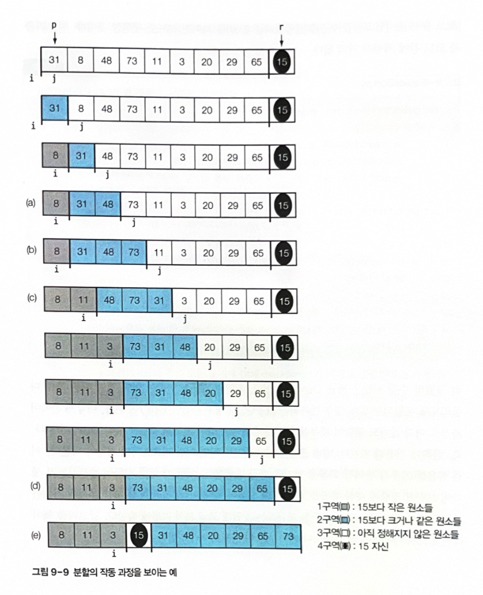
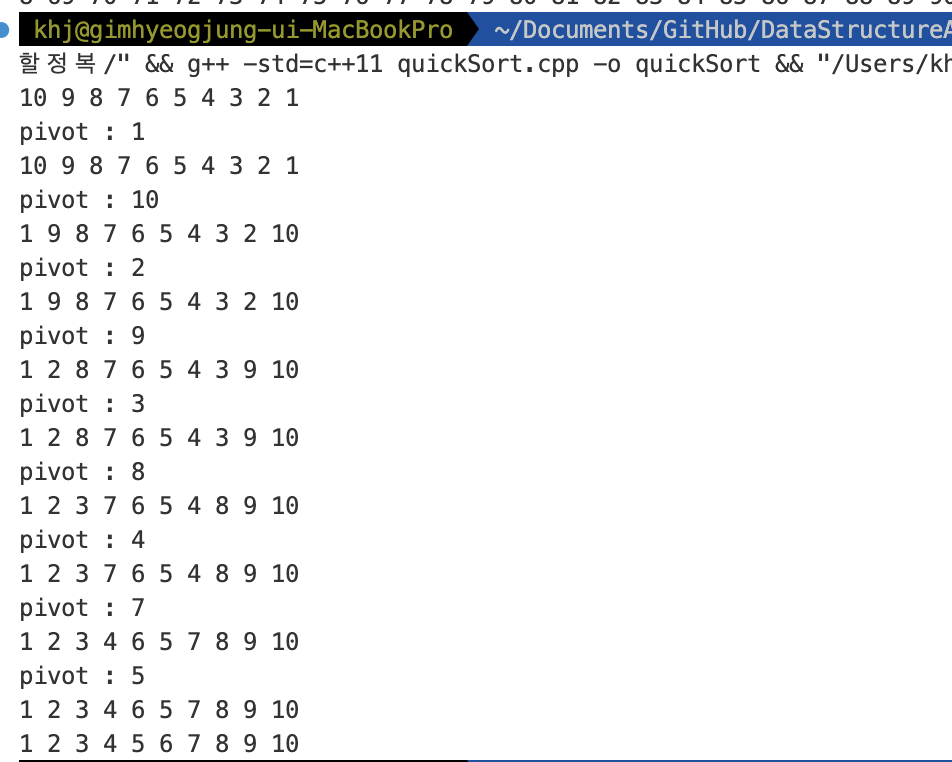
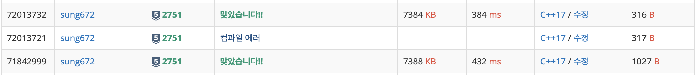
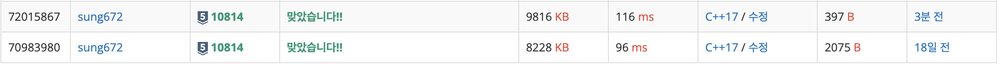

# TEAM Algorithm
ktc동아리 알고리즘 팀 김혁중

## 🕰️ 발표날짜 : 1월 22일 월요일

## 🖥️ 분할정복 소개
분할 정복(Divide and Conquer)은 여러 알고리즘의 기본이 되는 해결방법으로, 기본적으로는 엄청나게 크고 방대한 문제를 조금씩 조금씩 나눠가면서 용이하게 풀 수 있는 문제 단위로 나눈 다음 그것들을 다시 합쳐서 해결하자는 개념에서 출발하였다


## ⏳ 여러 형태의 시간복잡도
- NP
- EXPTIME
- PSPACE

## 1️⃣ 특정 값을 검색하기
정렬된 목록에서 특정 값을 검색할 때
1.	시퀀스 전체 원소를 방문하면서 해당 원소가 N과 같은지를 확인하는 것
이는 입력시퀀스의 정렬여부와 상관없이 항상 잘 작동한다. 하지만 시간 복잡도가 O(n)며 주어진 배열이 정렬되어 있다는 것을 이용하지 않는다. 
2.	이진 검색을 사용한다. 이진 검색은 정렬된 시퀀스에 대해서 가운데 원소와 찾고자 하는 값을 비교한 뒤 그 원소가 존재할 수 있는 작은 부분으로 축소하여 앞에 작업을 반복한다.


---
### 🧑‍🏭 이진 검색의 예

**주어진 배열, 찾으려는 값 : 9**

| 1 | 2 | 3 | 4 | 5 | 6 | 7 | 8 | 9 |
| --- | --- | --- | --- | --- | --- | --- | --- | --- |


1️⃣ **주어진 배열에서 중앙값을 찾는다.**

| 1 | 2 | 3 | 4 | <span style="color:red"><p>5</p><em></span> | 6 | 7 | 8 | 9 |
| --- | --- | --- | --- | --- | --- | --- | --- | --- |


2️⃣ **중앙값과 찾으려는 값을 비교하여 찾으려는 값이 크다면 범위를 좁혀서 1번을 반복한다.**

| 1 | 2 | 3 | 4 | <span style="color:red"><p>5</p><em></span> | 6 | 7 | 8 | 9 |
| --- | --- | --- | --- | --- | --- | --- | --- | --- |

3️⃣ **6에서 9사이의 수 중에서 중앙값을 찾아 9와 비교한다**

| 1 | 2 | 3 | 4 | 5 | <span style="color:blue">6</span> | <span style="color:red"><p>7</p><em></span> | <span style="color:blue">8</span> |<span style="color:blue">9</span> |
| --- | --- | --- | --- | --- | --- | --- | --- | --- |

4️⃣ **찾으려는 값이 7보다 크므로 8과 9로 범위를 좁혀서 1번을 반복한다**

| 1 | 2 | 3 | 4 | 5 | 6 | 7 | <span style="color: blue"><p>8</p></span> | <span style="color: blue">9</span> |
| --- | --- | --- | --- | --- | --- | --- | --- | --- |

5️⃣ **8보다 9가 크므로 범위를 좁혀 9부터 9까지의 중앙값과 9를 비교한다**

중앙값이 9이므로 값이 같아 검색을 성공한다.
| 1 | 2 | 3 | 4 | 5 | 6 | 7 | 8 | <span style="color: blue"><p>9</p></span> |
| --- | --- | --- | --- | --- | --- | --- | --- | --- |


## 👨‍💻 이진탐색 수도코드
```C++
BinarySearch(A[0..N-1], value, p, r) {
  if (p > r)
    return -1
  q = (p + r) / 2 // 중간 요소 설정(floor)
  if (A[q] > value)
    return BinarySearch(A, value, p, q - 1) //[low, mid)
  else if (A[q] < value)
    return BinarySearch(A, value, q + 1, r) // (mid, high)
  else
    return q
}
```

## 🎱 이진탐색 구현
```cpp
#include <iostream>
#include <vector>
#include <chrono>
#include <random>
#include <algorithm>
#include <ctime>

bool linear_search(int n, std::vector<int>& s) {
    for(auto i : s) {
        if(i == n) {
            return true;
        }
    }
    
    return false;
}

bool binarySearchRecursive(int n, int st, int end, std::vector<int>& s) {
    if(st > end) {
        return false;
    } else {
        int mid = (st + end) / 2;
        if(n == s[mid]) {
            return true;
        } else if(n < s[mid])  {
            return binarySearchRecursive(n, st, mid - 1, s);
        } else {///}(n > s[i])
            return binarySearchRecursive(n, mid + 1, end, s);
        }
    }
}

bool binarySearch(int N, std::vector<int>& s) {
    return binarySearchRecursive(N, 0, int(s.size()) - 1, s);
}

int main(void) {
    srand(unsigned(time(0)));
    using namespace std;
    
    vector<int> a(100);
    generate(a.begin(), a.end(), []() {
        return rand() % 100;
    });
    sort(a.begin(), a.end());
    
    for(auto i : a) {
        cout << i << " ";
    }
    cout << '\n';
    cout << binarySearch(10, a);
    
    
    
    
    return 0;
}

```
### 출력결과


## 2️⃣ 분할정복을 이용하여 정렬하기
효율적인 정렬알고리즘은 매우 중요하다.
데이터를 정렬해 놓으면 로그 함수 시간복잡도로 저장된 데이터에 접근가능하다.
이를 분할정복을 이용하여 구현할 것이다.

정렬알고리즘의 요구사항


1. 모든 데이터 타입에 대해서 작동해야한다. (서로 다른 구조체를 멤버기준으로 정렬이 가능해야한다.)
2. 많은 양의 데이터를 처리할 수 있어야한다.
3. 정렬알고리즘은 점근적 시간복잡도 측면이나 실제 동작시에 빠르게 동작해야한다.


---

### 🍔 병합정렬
병합정렬은 많은 원소로 구성된 전체 집합을 작은 크기의 부분집합으로 나눠 각각을 정렬하고, 정렬된 부분집합을 오름차순 또는 내림차순 순서를 유지하면서 합치는 방식이다.

### 🐬 병합정렬 수도코드
```cpp
mergeSort(A[], p, r) {
    if(p < r) {
        q <- [(p+r)/2] ///p와 r의 중간 지점 계산
        mergeSort(A, p, q) ///q기준으로 전반부 정렬
        mergeSort(A, q + 1, r) ///q기준으로 후반부 정렬
        merge(A, p, q, r) ///병합
    }
}

merge(A[], p, q, r) {
    정렬된 두 리스트 A[p...q]와 A[q + 1... r]을 합쳐
    정렬된 하나의 A[p...r]을 만든다.
}
```

### ⭐ 병합정렬 예시(수도코드)
**주어진 배열**

| 2 | 6 | 7 | 3 | 1 | 9 | 5 | 4 | 8 |
| --- | --- | --- | --- | --- | --- | --- | --- | --- |

1️⃣ 중간지점 계산 -> 1, 1을 기준으로 왼쪽 오른쪽 정렬 후 병합
| 2 | 6 | 7 | 3 | 1 | 9 | 5 | 4 | 8 |
| --- | --- | --- | --- | --- | --- | --- | --- | --- |


| <span style="color:blue">1</span> | <span style="color:blue">2</span> | <span style="color:blue">3</span> | <span style="color:blue">6</span> | <span style="color:blue">7</span> | <span style="color:red"><p>4</p><em></span> | <span style="color:red"><p>5</p><em></span> | <span style="color:red"><p>8</p><em></span> | <span style="color:red"><p>9</p><em></span> |
| --- | --- | --- | --- | --- | --- | --- | --- | --- |


2️⃣ 두 배열을 순서대로 병합
| 1 | 2 | 3 | 4 | 5 | 6 | 7 | 8 | 9 |
| --- | --- | --- | --- | --- | --- | --- | --- | --- |


### 🏀 병합정렬 수도코드 구체화
```cpp
#include <iostream>
#include <vector>
#include <algorithm>

void merge(int st, int mi, int end, std::vector<int>& v) {
    std::vector<int> tmp(end - st + 1);
    int i = st;
    int j = mi + 1;
    int t = 0;
    
    while(i <= mi && j <= end) {
        if(v[i] <= v[j]) {
            tmp[t++] = v[i++];
        } else {
            tmp[t++] = v[j++];
        }
    }
    
    while(i <= mi) {
        tmp[t++] = v[i++];
    }
    
    while(j <= end) {
        tmp[t++] = v[j++];
    }
    
    t = 0;
    for(int i = st; i <= end; i++) {
        v[i] = tmp[t++];
    }
}

void mergeSort(int st, int end, std::vector<int>& v) {
    if(st < end) {
        int mid = (st + end) / 2;
        mergeSort(st, mid, v);
        mergeSort(mid + 1, end, v);
        merge(st, mid, end, v);
    }
}


int main(void) {
    using namespace std;
    
    vector<int> v(100);
    int i = 100;
    generate(v.begin(), v.end(), [&i]() {
        return i--;
    });
    
    
    for(auto a : v) {
        std::cout << a << " ";
    }
    
    std::cout << '\n';
    
    mergeSort(0, int(v.size()) - 1, v);
    
    for(auto a : v) {
        std::cout << a << " ";
    }
    
    return 0;
}

```
### 출력


### 🏈 병합정렬 예시(실제 코드)

1️⃣ 주어진 배열에서 중간 값 1을 기준으로 분할
| 2 | 6 | 7 | 3 | 1 | 9 | 5 | 4 | 8 |
| --- | --- | --- | --- | --- | --- | --- | --- | --- |

2️⃣ 왼쪽과 오른쪽에서 중앙값 7과 5를 찾아서 분할한다
| 2 | 6 | 7 | 3 | 1 |
| --- | --- | --- | --- | --- |

| 9 | 5 | 4 | 8 |
| --- | --- | --- | --- |

3️⃣ 중앙값 6과 3, 9, 4를 찾아.
| 2 | 6 | 7 |
| --- | --- | --- |

| 3 | 1 |
| --- | --- |

| 9 | 5 |
| --- | --- |

| 4 | 8 |
| --- | --- |

4️⃣  분할 한다.
| 2 |
| --- |


| 6 | 7 |
| --- | --- |

| 3 |
| --- |

| 1 |
| --- |

| 9 |
| --- |

| 5 |
| --- |

| 4 |
| --- |

| 8 |
| --- |

5️⃣ 병합을 진행한다

| 2 | 6 | 7 |
| --- | --- | --- |

| 1 | 3 |
| --- | --- |

| 5 | 9 |
| --- | --- |

| 4 | 8 |
| --- | --- |

6️⃣ 반복
| 1 | 2 | 3 | 6 | 7 |
| --- | --- | --- | --- | --- |

| 4 | 5 | 8 | 9 |
| --- | --- | --- | --- |

7️⃣ 반복
| 1 | 2 | 3 | 4 | 5 | 6 | 7 | 8 | 9 |
| --- | --- | --- | --- | --- | --- | --- | --- | --- |

---
### 🪡 병합부분

```cpp
void merge(int st, int mi, int end, std::vector<int>& v) {
    std::vector<int> tmp(end - st + 1);
    int i = st;
    int j = mi + 1;
    int t = 0;
    
    while(i <= mi && j <= end) {
        if(v[i] <= v[j]) {
            tmp[t++] = v[i++];
        } else {
            tmp[t++] = v[j++];
        }
    }
    
    while(i <= mi) {
        tmp[t++] = v[i++];
    }
    
    while(j <= end) {
        tmp[t++] = v[j++];
    }
    
    t = 0;
    for(int i = st; i <= end; i++) {
        v[i] = tmp[t++];
    }
}
```


## 🥃 퀵정렬
병합정렬의 목적은 대용량의 데이터를 정렬하는 것이 목적이다.
퀵정렬은 평균 실행시간을 줄이는 것이 목표이다.

병합정렬에서 분할 과정은 단순히 중간 인덱스값을 기준으로 분할 하였다면, 퀵 정렬에서는 임의로 값을 정해서 그 값을 기준으로 작은 값들과 큰값들로 분할하는 것을 반복하여 정렬한다.

### 🍙 퀵정렬의 분할 연산 방법
1. 입력배열에 대해 피벗원소를 정한다.
2. 피벗원소를 기준으로 작은 값은 왼쪽부분에 큰 값은 오른쪽 부분으로 옮긴다.
3. 왼쪽과 오른쪽 집합에 대해서 1번을 수행하며 과정을 반복한다.
   

### 🍩 퀵정렬 수도코드
```cpp
quickSort(A[], p, r) {
    if(p < r) {
        q = partition(A, p, r); ///피벗을 기준으로 분할한 후 피벗의 인덱스를 반환한다.
        quickSort(A, p, q - 1); ///왼쪽부분에 대해 재귀호출 한다.
        quickSort(A, q + 1, r); ///오른쪽 부분에 대해 재귀호출한다.
    }
}
///i는 p-1에서 시작
///j는 p에서 시작 r전까지 이동
partition(A[], p, r) {
    x = rand(p, r) ///p와 r사이의 임의의 값을 뽑는다.
    A[x] <-> A[r] ///피벗값을 맨뒤로 이동시킨다.

    i = p - 1
    for j p to r - 1 {
        if(A[j] < A[r]) {
            A[++i] = A[j]
        }
    }
    A[i + 1] <-> A[r] ///피벗이 있어야 할 자리에 돌려놓음

    return i + 1
}
```

### ✨ 퀵정렬 예시


- 1구역 : [p, i] 피벗값보다 작은 값들이 위치하는 부분
- 2구역 : (i, j) 피벗값보다 큰 값들이 위치하는 부분
- 3구역 : [j, r) 조사해야할 값들이 위치하는 부분
- 4구역 : r 피벗이 위치하는 부분

### 🤔 퀵정렬 코드
```cpp
#include <iostream>
#include <vector>

void swap(int &a, int& b) {
    int tmp = a;
    a = b;
    b = tmp;
}

int partition(std::vector<int>& v, int p, int r) {
    int i = p - 1;
    int q = v[r]; ///pivot
    int j = p;
    while(j != r) {
        if(v[j] < q) {
            swap(v[++i], v[j]);
        }
        j++;
    }
    std::cout << "pivot : " << q << '\n';
    for(auto& a: v) {
        std::cout << a << " ";
    }
    std::cout << '\n';
    swap(v[i + 1], v[r]);
    
    
    return i + 1;
}

void quickSortRecursive(std::vector<int>& v, int p, int r) {
    if(p < r) {
        int q = partition(v, p, r); ///index of pivot
        quickSortRecursive(v, p, q - 1);
        quickSortRecursive(v, q + 1, r);
    }
}

void quickSort(std::vector<int>& v) {
    quickSortRecursive(v, 0, int(v.size()) - 1);
}

int main(void) {
    using namespace std;
    vector<int> v(10, -1);
    int t = 10;
    for(auto& a: v) {
        a = t--;
    }
    
    for(auto& a: v) {
        cout << a << " ";
    }
    cout << '\n';
    
    quickSort(v);
    
    for(auto& a: v) {
        cout << a << " ";
    }
    cout << '\n';
    
    
    return 0;
}

```

### 🌈 출력 


### 참고 : template quickSort code
```cpp
#include <iostream>
#include <vector>

template <typename T>
void swap(T& a, T& b) {
    T tmp = a;
    a = b;
    b = tmp;
}

template<typename T>
int partition(std::vector<T>& v, int p, int r) {
    int i = p - 1;
    int j = p;
    T q = v[r]; ///pivot
    while(j != r) {
        if(v[j] < q) {
            swap<T>(v[++i], v[j]);
        }
        j++;
    }
    swap<T>(v[i + 1], v[r]);
    
    return i + 1;
}

template<typename T>
void quickSortRecursive(std::vector<T>& v, int p, int r) {
    if(p < r) {
        int q = partition<T>(v, p, r);
        quickSortRecursive<T>(v, p, q - 1);
        quickSortRecursive<T>(v, q + 1, r);
    }
}

template<typename T>
void quickSort(std::vector<T>& v) {
    quickSortRecursive<T>(v, 0, int(v.size()) - 1);
}

int main(void) {
    using namespace std;
    
    vector<float> v = {11.4, 0.3, 9.5, 4.6, 6.9, 20.3};
    for(auto k: v) {
        cout << k << " ";
    }
    
    cout << '\n';
    
    quickSort<float>(v);
    
    for(auto k: v) {
        cout << k << " ";
    }
    
    cout << '\n';
    
}
```

### 🧐 백준 정렬문제 해법
https://www.acmicpc.net/problem/2751
```cpp
#include <cstdio>
#include <cstdlib>
#include <vector>
#include <ctime>

void swap(int& a, int& b) {
   int tmp = a;
   a = b;
   b = tmp;
}

int _rand(int p, int r) {
   return rand() % (r - p + 1) + p; 
}

int partition(std::vector<int>& v, int p, int r) {
   int i = p - 1;
   int j = p;
   swap(v[_rand(p, r)], v[r]);

   while(j != r) {
      if(v[j] <= v[r]) {
         swap(v[++i], v[j]);
      }
      j++;
   }
   swap(v[i + 1], v[r]);

   return i + 1;
}

void quickSortRecursive(std::vector<int>& v, int p, int r) {
   if(p <= r) {
      int q = partition(v, p, r);
      quickSortRecursive(v, p, q - 1);
      quickSortRecursive(v, q + 1, r);
   }
}

void quickSort(std::vector<int>& v) {
   quickSortRecursive(v, 0, v.size() - 1);
}

int main(void) {

   srand((unsigned int)time(0));

   std::vector<int> v;
   int n, m;
   scanf("%d", &n);

   for(int i = 0; i < n; i++) {
      scanf("%d", &m);
      v.push_back(m);
   }

   quickSort(v);

   for(auto i : v) {
      printf("%d\n", i);
   }
   

   return 0;
}
```
### 🫣 algorithm header에 있는 sort사용하기
```cpp
#include <cstdio>
#include <vector>
#include <algorithm>

int main(void) {
   std::vector<int> v;
   int n, m;
   scanf("%d", &n);

   for(int i = 0; i < n; i++) {
      scanf("%d", &m);
      v.push_back(m);
   }

    sort(v.begin(), v.end());

   for(auto i : v) {
      printf("%d\n", i);
   }
   

   return 0;
}
```
#### 결과



## 🫢 Linear Time Selection
#### 선형시간탐색의 목적은 i번째로 작은 원소의 인덱스를 얻는 것이다. 따라서 주어진 배열을 정렬하여 i번째로 작은 원소값인지 확인하면 맞는지 확인할 수 있다.


1. 주어진 배열A를 같은 크기씩 나눈다.
2. 각 배열의 중앙값들을 M배열에 넣는다.
3. M배열의 중앙값 m을 찾아 A에서 m값을 기준으로 partition하여 q값이 찾으려는 값이면 인덱스를 반환한다.
4. 찾으려는 값이 더 큰 경우 오른쪽 집합에 대해서 1번을 반복한다.

```cpp
#include <iostream>
#include <vector>

void swap(int &a, int& b) {			
    int tmp = a;
    a = b;	
    b = tmp;
}
	
int partition(std::vector<int>& v, int p, int r) { ///피벗의 인덱스는 주어진 r과 같다.
    int i = p - 1;
    int q = v[r]; ///pivot
    int j = p;
    while(j != r) {
        if(v[j] < q) {
            swap(v[++i], v[j]);
        }
        j++;
    }
//    std::cout << "pivot : " << q << '\n';
//    for(auto& a: v) {
//        std::cout << a << " ";
//    }
//    std::cout << '\n';
    swap(v[i + 1], v[r]);
    
    
    return i + 1;
}

int partition(std::vector<int>& v, int p, int q, int r) { ///기존의 퀵솔트와는 다르게 인자로 피벗의 인덱스를 받는다.
   int i = p - 1;
   int pi = v[q];
   int j = p;
   while(j != r) {
      if(v[j] < pi && j != q) {
         swap(v[++i], v[j]);
      }
      j++;
   }
    swap(v[i + 1], v[q]);
    
    return i + 1;
    
}

void quickSortRecursive(std::vector<int>& v, int p, int r) {///주어진 벡터를 재귀호출하여 퀵솔트하는 함수이다.
    if(p < r) {
        int q = partition(v, p, r); ///index of pivot
        quickSortRecursive(v, p, q - 1);
        quickSortRecursive(v, q + 1, r);
    }
}

void quickSort(std::vector<int>& v) {///주어진 벡터를 퀵솔트한다.
    quickSortRecursive(v, 0, int(v.size()) - 1);
}

void quickSort(std::vector<int>& v, int st, int end) { ///주어진 벡터를 시작과 끝값을 받아 부분 퀵정렬하는 함수이다.
   quickSortRecursive(v, st, end);
}

int findMedianValue(std::vector<int>& v, int p, int r) { ///주어진 벡터에서 중앙값을 찾는 함수이다.
   quickSortRecursive(v, p, r);

   return v[(p + r) / 2];
}


    /*
       v : 주어진 벡터
       p : 시작 인덱스
       r : 끝 인덱스
       i : i번째로 큰 값을 구하려고자 함

       과정 1: 주어진 인덱스를 이용하여 5개씩 분할하여 중앙값을 찾아 M에 넣음
       과정 2: M에서 중앙값을 찾아 주어진 벡터에서의 인덱스를 구한 뒤, 그 값을 피벗으로 파티션함
       과정 3: 피벗값과 i값이 일치하면 찾은거니 피벗의 인덱스를 반환
              i값이 피벗값보다 작은 경우 피벗의 전인덱스 값을 전달하여 함수를 재귀호출함
              i값이 피벗값보다 큰 경우 피벗의 후인덱스 값을 전달하여 함수를 재귀호출함
    */
int linTimeSelection(std::vector<int>& v, int p, int r, int i) {
    int size = r - p + 1;
    
    // 크기가 작을 때는 정렬해서 i번째 값을 찾음
    if (size <= 5) {
        quickSort(v, p, r);
        return p + i;
    }

    std::vector<int> medians;
    for (int j = p; j <= r; j += 5) {
        int subR = j + 4;
        if (subR > r) {
            subR = r;
        }

        int medianIdx = linTimeSelection(v, j, subR, (subR + 1 - j) / 2);
        medians.push_back(v[medianIdx]);
    }

    int medianOfMediansIdx = linTimeSelection(medians, 0, medians.size() - 1, medians.size() / 2) * 5 + p;
    
    
    int q = partition(v, p, medianOfMediansIdx, r);

    if (i == q - p) {
        return q;
    } else if (i < q - p) {
        return linTimeSelection(v, p, q - 1, i);
    } else {
        return linTimeSelection(v, q + 1, r, i - (q - p + 1));
    }
}


int main(void) {
   using namespace std;

   vector<int> s1 = {10, 8, 3, 4, 2, 9, 11, 14, 18};
   
    int result3 = linTimeSelection(s1, 0, int(s1.size()) - 1, 3);
    int result2 = linTimeSelection(s1, 0, int(s1.size()) - 1, 2);
    int result5 = linTimeSelection(s1, 0, int(s1.size()) - 1, 5);
    int result6 = linTimeSelection(s1, 0, int(s1.size()) - 1, 6);
    int result10 = linTimeSelection(s1, 0, int(s1.size()) - 1, 10);
    cout << "before sorting\n";
    for(auto s : s1) {
        cout << s << " ";
    }
    cout << '\n';
    
    cout << "3 Result: " << s1[result3] << endl;
    cout << "2 Result: " << s1[result2] << endl;
    cout << "5 Result: " << s1[result5] << endl;
    cout << "6 Result: " << s1[result6] << endl;
    cout << "10 Result: " << s1[result10] << endl;
    
    cout << "sorted vector" << '\n';
    quickSort(s1);
    for(auto s : s1) {
        cout << s << " ";
    }
    
    cout << '\n';

   return 0;
}

```

### 결과


## 참고 quickSelection
https://www.daleseo.com/quick-select/


## 🧐 백준정렬문제 해법2
https://www.acmicpc.net/problem/10814

풀이 1
```cpp
#include <iostream>
#include <list>

struct Node {
    int n;
    std::list<std::string> d;
    Node* left;
    Node* right;
};

class BinaryTree {
    public:
        Node* root;

        BinaryTree() {
            root = nullptr;
        }

        void insert(int n, std::string data) {
            root = insertRecursive(root, n, data);
        }

        Node* insertRecursive(Node* current, int n, std::string data) {
            if(current == nullptr) {
                Node* newNode = new Node();
                newNode->left = nullptr, newNode->right = nullptr;
                newNode->n = n;
                newNode->d.push_back(data);
                return newNode;
            }

            if(n < current->n) {
                current->left = insertRecursive(current->left, n, data);
            } else if(n > current->n) {
                current->right = insertRecursive(current->right, n, data);
            } else if(n == current->n) {
                current->d.push_back(data);
            } else if(n == current->n) {
                if(n < current->n) {
                    current->left = insertRecursive(current->left, n, data);
                } else {
                    current->right = insertRecursive(current->right, n, data);
                }
            }

            return current;
        }

        void inOrderTraversal(Node *root) {
            if(root == nullptr) {
                return ;
            }
            
            inOrderTraversal(root->left);
            
            std::list<std::string> d = root->d;
            while(!d.empty()) {
                std::cout << root->n << " " << d.front() << '\n';
                d.pop_front();
            }

            inOrderTraversal(root->right);
            
        }
};

int main(void) {
    using namespace std;

    BinaryTree b = BinaryTree();
    int n;
    cin >> n;

    for(int i = 0; i < n; i++) {
        int m;
        string input;
        cin >> m;
        cin >> input;

        b.insert(m, input);
    }

    b.inOrderTraversal(b.root);

    return 0;
}
```

풀이2
```cpp
#include <iostream>
#include <map>
#include <set>

int main(void) {

   int n, m;
   std::string tmp;
   std::cin >> n;
   std::multimap<int, std::string> ma;
   for(int i = 0; i < n; i++) {
      std::cin >> m >> tmp;
      ma.insert(make_pair(m, tmp));
   }

   for(auto ptr = ma.begin(); ptr != ma.end(); ptr++) {
      std::cout << ptr->first << " " << ptr->second << '\n';
   }
   return 0;
}
```

#### 결과
