## 🧐 dijkstra 알고리즘 최적화

다익스트라 알고리즘은 최단거리표(shortest path table)을 사용하여 모든 정점을 방문하면서 최단거리표를 업데이트한다.

### 🤗 다익스트라 알고리즘의 최단거리표 작성 과정
1. 최단거리표에서 시작정점의 값을 0으로 놓는다.
2. 방문하지 않은 정점들의 집합에서 최단거리표의 값이 가장 작고 방문하지 않은 정점을 고른다. 찾은 정점을 작은 정점이라 하겠다.
3. 작은 정점을 방문하지 않은 정점에서 제거한다.
4. 작은 정점의 인접정점에 대해서 최단거리표를 참고하여 작은 값으로 업데이트한다. (시작 지점부터 작은정점까지 이동할 때 가중치의 합은 최단거리표를 참고할 수 있으며 작은 정점부터 인접정점까지의 가중치는 엣지를 통해 얻을 수 있으며 두 합이 인접정점에 대해 최단거리표 값보다 작다면 업데이트 한다)
5. 방문하지 않은 정점이 없을 때까지 반복한다.

```cpp
#include <cstdio>
#include <vector>
#include <list>

std::vector<std::vector<std::pair<int, int> > > mat(9, std::vector<std::pair<int, int> >(9));

void backTrackingRecursive(int st, int cur, std::vector<std::pair<int, int> > sht) {
   if(cur != st) {
      backTrackingRecursive(st, sht[cur].second, sht);
      printf("%d\n", cur);
   }
}

void backTracking(int st, int end, std::vector<std::pair<int, int> > sht) {
   printf("%d\n", st);
   backTrackingRecursive(st, end, sht);
}


void dijkstra (int vn, int st, int end){
   std::vector<std::pair<int, int> > sht(vn + 1, std::pair<int, int>(10000, -1));
   std::list<int> unvisited;
   
   for(int i = 1; i < vn + 1; i++) {
      unvisited.push_front(i);
   }

   sht[st].first = 0;

   while(!unvisited.empty()) {
      int tmpMin = 100000;
      int mv;
      for(int i = 1; i < vn + 1; i++) {
         if(find(unvisited.begin(), unvisited.end(), i) != unvisited.end() &&
            sht[i].first < tmpMin) {
               tmpMin = sht[i].first;
               mv = i;
            }
      }
      
      unvisited.erase(find(unvisited.begin(), unvisited.end(), mv));

      for(int j = 1; j < vn + 1; j++) {
         if(mat[mv][j].first == 1 && 
            sht[mv].first + mat[mv][j].second < sht[j].first
         ) {
            sht[j].first = sht[mv].first + mat[mv][j].second;
            sht[j].second = mv;
         }
      }
   }


   backTracking(st, end, sht);
}

int main(void) {
   int vn, en; ///vn : 정점의 개수, en : 간선의 개수
   int s, e, w; ///s : 시정점, e : 종정점, w : 가중치

   scanf("%d %d", &vn, &en);

   for(int i = 0; i < en; i++) {
      scanf("%d %d %d", &s, &e, &w);
      mat[s][e].first = 1;
      mat[s][e].second = w;
   }

   dijkstra(vn, 1, 6);

   return 0;
}
```
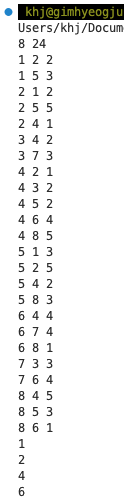


### 🌪️ 다익스트라 알고리즘을 우선순위 큐를 이용하여 최적화 하기
위 다익스트라 알고리즘은 방문하지 않은 정점 중 가장 최단거리표값이 가장 작은 정점을 찾는 과정에서 시간을 잡아먹는다. 따라서 우선순위 큐를 사용하여 업데이트를 했다면 우선순위큐에 추가하는 식으로 최적화 할 수 있다. 종료하는 시점엔 더 이상 최단거리표를 업데이트할 필요가 없다는 것이며, 이는 시작 정점부터 최단거리표가 완성되었다는 것이다.

```cpp
#include <iostream>
#include <vector>
#include <list>
#include <queue>
#include <limits>

class Edge {
public:
   int dst;
   int weight;

   Edge(int d, int w) : dst(d), weight(w) {}
};

class Graph {
public:
   std::vector<std::list<Edge>> vertices;

   Graph(int size) {
      vertices.resize(size + 1);
   }

   void addEdge(int src, int dst, int weight) {
      vertices[src].push_back(Edge(dst, weight));
   }
};

void getData(std::priority_queue<std::pair<int, int>, std::vector<std::pair<int, int>>, std::greater<std::pair<int, int>>> pq) {
   printf("--------\n");
   while(!pq.empty()) {
      printf("%d %d\n", pq.top().first, pq.top().second);
      pq.pop();
   }
}

void dijkstra(int vn, int st, const Graph& G) {
   std::vector<int> sht(vn + 1, std::numeric_limits<int>::max());
   std::priority_queue<std::pair<int, int>, std::vector<std::pair<int, int>>, std::greater<std::pair<int, int>>> pq;

   sht[st] = 0;
   pq.push(std::make_pair(0, st));

   while (!pq.empty()) {
      getData(pq);
      int mv = pq.top().second;
      pq.pop();
      for (const auto& edge : G.vertices[mv]) {
         if (sht[mv] != std::numeric_limits<int>::max() && sht[mv] + edge.weight < sht[edge.dst]) {
            sht[edge.dst] = sht[mv] + edge.weight;
            pq.push(std::make_pair(sht[edge.dst], edge.dst));
         }
      }
   }

   for (int i = 1; i <= vn; ++i) {
      if (sht[i] != std::numeric_limits<int>::max()) {
         std::cout << sht[i] << "\n";
      } else {
         std::cout << "INF\n";
      }
   }
}

int main() {
   int vn, en, st;
   std::cin >> vn >> en >> st;

   Graph G(vn);

   for (int i = 0; i < en; ++i) {
   int s, e, w;
   std::cin >> s >> e >> w;
   G.addEdge(s, e, w);
   }

   dijkstra(vn, st, G);

   return 0;
}
```
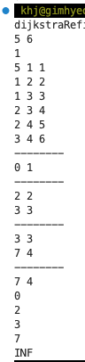

```cpp
dijkstra(vn, st, G):
   vn: 정점수
   st: 시작정점
   G: 그래프

   shortest_path 초기화 : sht
   priority_queue : pq 최소힙으로 선언

   sht[st] <- 0
   pq = {0, st}

   while(pq is not empty):
      mv <- pq.top.vertex : minimum vertex that sorted by shortest table

      for x ∈ adj(mv):
         if(sht[x] is not lim and sht[mv] + x.weight < sht[x]) {
            sht[x] = sht[mv] + x.weight
            pq <- {sht[x], x}
         }
   
```


## 🥸 그래프 알고리즘2

- 다익스트라 알고리즘의 문제점 확인
- 벨만 포드 알고리즘
- 음수 가중치 사이클
- 존슨 알고리즘
- 코사라주 알고리즘

### 다익스트라 알고리즘의 문제점
다익스트라 알고리즘은 그리디 방식으로 매 그래프를 순회할 때마다 가장 거리가 가까운 정점을 고르며 이미 방문한 정점에 대해서 최단 경로가 결정되어 있다고 가정하므로 음수 가중치가 있는 경우 이미 방문한 경로를 재 탐색하지 않아 최적의 경로를 찾지 못 할 수도 있다.

이 예시에서 각 정점에 대해서 최적의 경로를 골라 그리디 방식으로 검색할 경우

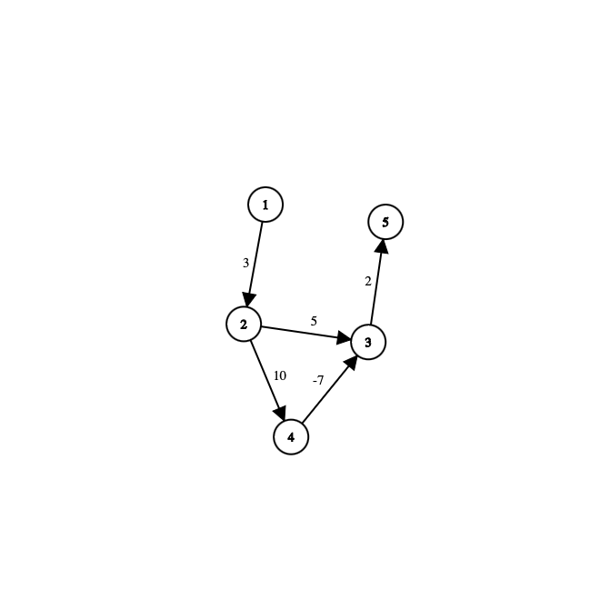
1. 1번 정점에서 2번정점으로 이동하여 기록한다.
2. 2번 정점에서 3번과 4번으로 이동하여 기록한다.
3. 3번에서 5번으로 이동하여 4번에서 3번으로 이동하지 않는다. (이미 최적의 경로가 설정되었다고 가정하여 검사하지 않는다.)


### 🤠 벨만 포드 알고리즘 수도 코드
```cpp
function BellmanFord(graph, source):
    // 그래프의 정점 수와 간선 수
    vertices = graph.vertices
    edges = graph.edges

    // 최단 거리 배열 초기화
    distance = [∞] * vertices
    distance[source] = 0

    // 간선을 이용한 최단 거리 갱신
    for i in 1 to vertices - 1:
        for each edge in edges:
            u = edge.start
            v = edge.end
            weight = edge.weight
            if distance[u] + weight < distance[v]:
                distance[v] = distance[u] + weight

    // 최단 거리 배열 반환
    return distance
```

### ✍️ 벨만 포드 알고리즘 수도 코드 설명
벨만 포드 알고리즘은 생각보다 단순하다.
다익스트라 알고리즘은 그리디 방식으로 매 탐색마다 최적의 해를 구했다고 가정하여 방문했던 정점에 대해서 조사하지 않는다. 하지만 벨만포드 알고리즘은 방문했던 정점에 대해서 인접한 정점의 거리 값을 작은 값으로 업데이트하면서 최적의 해를 구한다. 음수 가중치가 있는 경우 벨만 포드 알고리즘이 유리해 보인다. 음수 가중치가 없는 경우에는 다익스트라 알고리즘이 유리해보인다.

1. 각 정점에 대한 출발지로부터 최단 거리 배열을 무한대로 초기화하며 시작 정점에 대한 최단 거리값을 0으로 한다.
2. v - 1번 반복하면서 최단 거리값이 기록된 정점의 인접 정점들 까지의 최단 거리를 업데이트한다.
3. v - 1번 반복한 이후에도 업데이트된다면 음수 사이클이 있는 것이다. 이는 다음절에서 설명한다.

#### 🤔 V - 1번 간선을 검사하는 이유에 대해서
정점의 개수가 v개 일때 사이클을 거치지 않고 시작 정점으로 부터 임의의 정점으로 이동한다면 최대 v - 1번 이동할 수 있다.

### 🤖 벨만 포드 알고리즘 구현
```cpp
#include <cstdio>
#include <vector>
#include <list>
#include <numeric>

class Edge {
public:
   int dst;
   int weight;

   Edge(int d, int w) : dst(d), weight(w) {}
};

class Graph {
public:
   int size;
   std::vector<std::list<Edge>> G;

   Graph(int s) : size(s) {
      G.resize(s);
   }

   void addEdge(int s, int d, int w) {
      G[s].push_back(Edge(d, w));
   }
};

void bellmanFord(Graph& g) {
   std::vector<int> distance(g.size, std::numeric_limits<int>::max());
   distance[1] = 0;
   for(int j = 0; j < g.size - 2; j++) {
      for(int i = 1; i < g.size; i++) {
         for(auto& e : g.G[i]) {
            if(distance[i] != std::numeric_limits<int>::max() &&
               distance[i] + e.weight < distance[e.dst]
            ) {
               distance[e.dst] = distance[i] + e.weight;
            }
         }
      }
   }

   for(int i = 1; i < g.size; i++) {
      printf("%d : %d\n", i, distance[i]);
   }
}

int main(void) {
   using namespace std;

   Graph g(6);
   g.addEdge(1, 2, 3);
   g.addEdge(2, 3, 5);
   g.addEdge(2, 4, 10);
   g.addEdge(4, 3, -7);
   g.addEdge(3, 5 , 2);


   bellmanFord(g);

   return 0;
}
```
### 출력

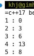

### ☠️ 음수 사이클
아래 예시에서 1->2 거리는 3이다. 하지만 2->3->2 사이클을 거치면 -2가 감소한 1이 되며 한번 더 사이클을 거치면 -1이 되어 거리값이 무한정으로 감소한다. 이를 파악하는 과정은 생각보다 쉽다. V개의 정점이 있을 때 임의의 정점에서 임의의 정점으로 가장 많이 거쳐 가는 경우는 v-1로 정해져 있다. 따라서 벨만 포드에서 v-1번 검사한 후 최단 거리가 얻어지는 데 음수 사이클이 있는 경우 그 이후에도 사이클을 거쳐 최단 거리가 갱신 된다. 이를 이용하여 v-1번 돌고 한번 더 돌아서 갱신이 되는 지 확인한 후 갱신이 된다면 음수 사이클이 발생한다는 것을 확인할 수 있을 것이다.
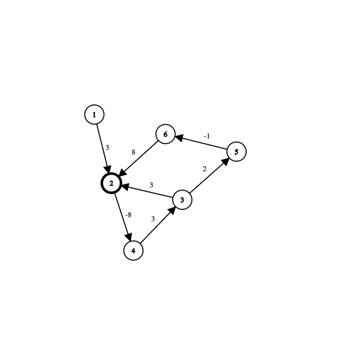


### 👊 음수 사이클 검사
```cpp
// 음수 사이클 검사
    for each edge in edges:
        u = edge.start
        v = edge.end
        weight = edge.weight
        if distance[u] + weight < distance[v]:
            // 음수 사이클이 존재함
            return "음수 사이클이 존재합니다."
```

## 🍰 음수 사이클 검사 코드 구현
```cpp
#include <cstdio>
#include <vector>
#include <list>
#include <numeric>

class Edge {
public:
   int dst;
   int weight;

   Edge(int d, int w) : dst(d), weight(w) {}
};

class Graph {
public:
   int size;
   std::vector<std::list<Edge>> G;

   Graph(int s) : size(s) {
      G.resize(s);
   }

   void addEdge(int s, int d, int w) {
      G[s].push_back(Edge(d, w));
   }
};

void bellmanFord(Graph& g) {
   std::vector<int> distance(g.size, std::numeric_limits<int>::max());
   distance[1] = 0;
   for(int j = 0; j < g.size - 2; j++) {
      for(int i = 1; i < g.size; i++) {
         for(auto& e : g.G[i]) {
            if(distance[i] != std::numeric_limits<int>::max() &&
               distance[i] + e.weight < distance[e.dst]
            ) {
               distance[e.dst] = distance[i] + e.weight;
            }
         }
      }
   }

   bool isCycled = false;

   for(int i = 1; i < g.size; i++) {
      for(auto& e : g.G[i]) {
         if(distance[i] != std::numeric_limits<int>::max() &&
            distance[i] + e.weight < distance[e.dst]
         ) {
            isCycled = true;
            break;
         }
      }
      if(isCycled) {
         break;
      }
   }
   
   if(isCycled) {
      printf("음수 사이클 존재!");
   } else {
      for(int i = 1; i < g.size; i++) {
         printf("%d : %d\n", i, distance[i]);
      }
   }
}

int main(void) {
   using namespace std;

   Graph g1(6);
   g1.addEdge(1, 2, 3);
   g1.addEdge(2, 3, 5);
   g1.addEdge(2, 4, 10);
   g1.addEdge(4, 3, -7);
   g1.addEdge(3, 5 , 2);


   bellmanFord(g1);

   Graph g2(7);
   g2.addEdge(1, 2, 3);
   g2.addEdge(2, 4, -8);
   g2.addEdge(3, 2, 3);
   g2.addEdge(4, 3, 3);
   g2.addEdge(3, 5, 2);
   g2.addEdge(5, 6, -1);
   g2.addEdge(6, 2, 8);

   bellmanFord(g2);

   return 0;
}
```
첫번째 그래프

이 그래프에서는 최단 거리값이 v-1번 조사한 후에 변함이 없으므로 음수 사이클이 존재하지 않는다.

두번째 그래프


정점 2는 v-1번 조사한 후에도 최단 거리값이 감소하므로 이는 음수 사이클이 존재한다고 할 수 있다.

### 😱 존슨 알고리즘
존슨 알고리즘에서는 전체 에지 가중치를 음수가 아닌 형태로 변환한다. 이때 벨만포드알고리즘과 수학 논리를 결합하여 이루어진다. 


### 🤑 존슨 알고리즘으로 최단거리를 찾는 과정 
존슨 알고리즘의 과정은 단순하다.
1. 더미 정점을 추가한다. 이 더미정점과 모든 정점은 연결되어 있으며 가중치는 0이다. 최단 거리표를 작성할 때 시작정점으로 가는 거리는 0으로 초기화 한다.
2. 벨만 포드 알고리즘을 이용하여 더미 정점과 나머지 정점들 사이의 최단 경로를 찾는다.
3. 이를 이용하여 양수 가중치로 변경하고 시작 정점에서 다익스트라 알고리즘을 적용한다.
### 😢 초기 상태
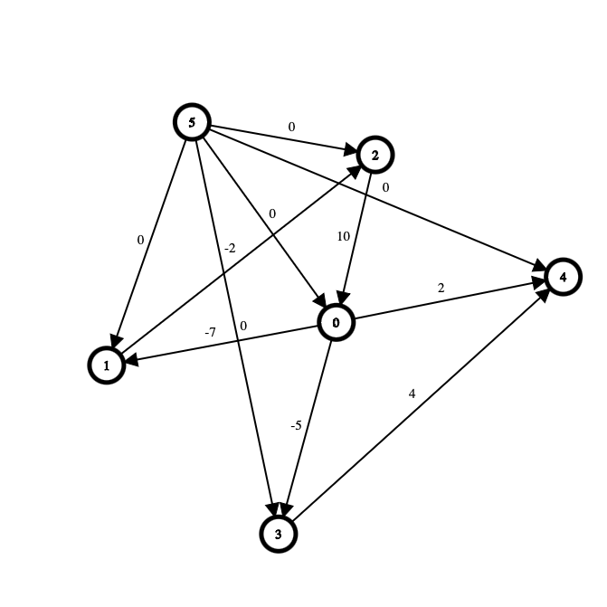

<table>
   <tr>
      <td>0</td>
      <td>1</td>
      <td>2</td>
      <td>3</td>
      <td>4</td>
      <td>5</td>
   </tr>
   <tr>
      <td>0</td>
      <td>inf</td>
      <td>inf</td>
      <td>inf</td>
      <td>inf</td>
      <td>0</td>
   </tr>
</table>


그림에서 5는 더미 정점이며 5에서 각 정점으로 가는 가중치값은 0이고 최단거리표에 작성된 값들은 시작정점을 제외하여 무한대로 설정하고 시작정점으로 가는 최단거리는 0으로 설정한다.

### 😇 코드
```cpp
#include <cstdio>
#include <vector>
#include <list>
#include <numeric>
#include <queue>

/*
   다익스트라는 가중치가 음수인 경우에 돌아가지 않음
   벨만 포드 알고리즘은 가중치가 음수인 경우에 돌아감

   존슨 알고리즘
   존슨 알고리즘에서는 전체 에지 가중치를 음수가 아닌 형태로 변환한다. 이때 벨만포드알고리즘과 수학 논리를 결합하여 이루어진다.
*/


class Edge {
public:
   int dst;
   int weight;

   Edge(int d, int w) : dst(d), weight(w) {}
};

class Graph {
public:
   int size;
   std::vector<std::list<Edge>> G;

   Graph(int s) : size(s) {
      G.resize(s);
   }

   void addEdge(int s, int d, int w) {
      G[s].push_back(Edge(d, w));
   }
};

std::vector<int> bellmanFord(Graph& g, int st) {
   std::vector<int> distance(g.size, std::numeric_limits<int>::max());
   distance[0] = 0; ///더미 정점 추가하기
   distance[st] = 0; ///더미 정점과 시작정점까지 최단거리는 0으로 초기화한다.
   for(int j = 0; j < g.size; j++) {
      for(int i = 1; i < g.size; i++) {
         for(auto& e : g.G[i]) {
            if(distance[i] != std::numeric_limits<int>::max() &&
               distance[i] + e.weight < distance[e.dst]
            ) {
               distance[e.dst] = distance[i] + e.weight;
            }
         }
      }
   } ///벨만 포드 알고리즘 적용

   bool isCycled = false;

   ///사이클 파악
   for(int i = 0; i < g.size - 1; i++) {
      for(auto& e : g.G[i]) {
         if(distance[i] != std::numeric_limits<int>::max() &&
            distance[i] + e.weight < distance[e.dst]
         ) {
            isCycled = true;
            break;
         }
      }
      if(isCycled) {
         break;
      }
   }

   return distance;
}

std::vector<int> dijkstra(int vn, int st, const Graph& g) {
   std::vector<int> sht(vn, std::numeric_limits<int>::max());
   std::priority_queue<std::pair<int, int>, std::vector<std::pair<int, int>>, std::greater<std::pair<int, int>>> pq;

   sht[st] = 0;
   pq.push(std::make_pair(0, st));

   while (!pq.empty()) {
      int mv = pq.top().second;
      pq.pop();
      for (const auto& edge : g.G[mv]) {
         if (sht[mv] != std::numeric_limits<int>::max() &&
             sht[mv] + edge.weight < sht[edge.dst]) {
            sht[edge.dst] = sht[mv] + edge.weight;
            pq.push(std::make_pair(sht[edge.dst], edge.dst));
         }
      }
   }

   return sht;
}
void Johnson(Graph& g) {
   Graph g1 = g;
   Graph g2 = g;
   Graph g3 = g;
   Graph g4 = g;
   Graph g5 = g;

   std::vector<int> distance1 = bellmanFord(g1, 1);
   std::vector<int> distance2 = bellmanFord(g2, 2);
   std::vector<int> distance3 = bellmanFord(g3, 3);
   std::vector<int> distance4 = bellmanFord(g4, 4);
   std::vector<int> distance5 = bellmanFord(g5, 5);

   for (int i = 1; i < g1.size; i++) {
      for (auto& e : g1.G[i]) {
         e.weight += distance1[i] - distance1[e.dst];
      }
   }

   std::vector<int> sht = dijkstra(g1.size, 1, g1);

   ///작성된 최단거리표에서 더미정점으로 부터 구한 최단거리표의 값들을 더해주면서 양수로 변환했던 가중치를 음수로 변환한다.
   for(int i = 1; i < g1.size; i++) {
      printf("%d %d\n", i, sht[i] + distance1[i]);
   }


   for (int i = 1; i < g2.size; i++) {
      for (auto& e : g2.G[i]) {
         e.weight += distance2[i] - distance2[e.dst];
      }
   }

   sht = dijkstra(g2.size, 2, g2);

   for(int i = 1; i < g2.size; i++) {
      printf("%d %d\n", i, sht[i] + distance2[i]);
   }

   for (int i = 1; i < g3.size; i++) {
      for (auto& e : g3.G[i]) {
         e.weight += distance3[i] - distance3[e.dst];
      }
   }

   sht = dijkstra(g3.size, 3, g3);

   for(int i = 1; i < g3.size; i++) {
      printf("%d %d\n", i, sht[i] + distance3[i]);
   }

   for (int i = 1; i < g4.size; i++) {
      for (auto& e : g4.G[i]) {
         e.weight += distance4[i] - distance4[e.dst];
      }
   }

   sht = dijkstra(g4.size, 4, g4);

   for(int i = 1; i < g4.size; i++) {
      printf("%d %d\n", i, sht[i] + distance4[i]);
   }

   for (int i = 1; i < g5.size; i++) {
      for (auto& e : g5.G[i]) {
         e.weight += distance5[i] - distance5[e.dst];
      }
   }

   sht = dijkstra(g1.size, 5, g5);

   for(int i = 1; i < g5.size; i++) {
      printf("%d %d\n", i, sht[i] + distance5[i]);
   }
}

int main(void) {
   using namespace std;

   Graph g1(6);
   g1.addEdge(1, 2, -7);
   g1.addEdge(2, 3, -2);
   g1.addEdge(3, 1, 10);
   g1.addEdge(1, 4, -5);
   g1.addEdge(1, 5, 2);
   g1.addEdge(4, 5, 4);
   g1.addEdge(0, 1, 0);
   g1.addEdge(0, 2, 0);
   g1.addEdge(0, 3, 0);
   g1.addEdge(0, 4, 0);
   g1.addEdge(0, 5, 0);

   Johnson(g1);


   return 0;
}
```

## 🫣 kosaraju 알고리즘

### 🪡 연결요소
여러 연결 요소로 구성된 그래프들이 존재할 것이다.
이때 연결요소끼리 이동이 불가능한 경우가 있을 수도 있고 연결요소들끼리 이동이 가능할 수도 있다. 우리는 연결요소들끼리 즉 부분그래프들 사이에 이동하는 경로가 존재하면 식별하여 부분그래프들의 집합을 코사라주 알고리즘을 통해서 얻을 수 있다.

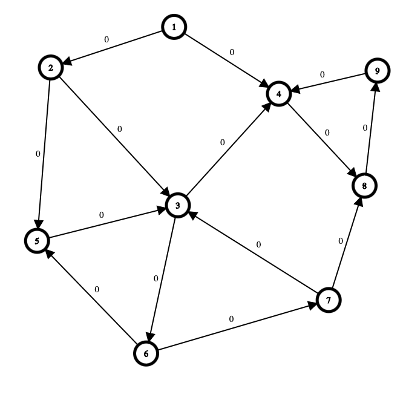

위 그림에서 1번 정점은 하나의 연결 요소인 것이다.
2번정점도 하나의 연결 요소이며 3번 5번 6번 7번 정점으로 그려지는 부분그래프도 하나의 연결요소이며 4번 8번 9번도 하나의 연결요소이다. 이들의 연결요소들끼리는 이동이 가능하며 이때 부분그래프들을 강한 연결요소라고 한다.

### 🤖 코사라주 알고리즘의 강한연결요소를 찾는 과정
1. DFS를 진행하여 방문한 정점들을 순서대로 스택에 넣는다.
2. 그래프의 간선의 방향을 모두 역전시킨다
3. 스택에서 정점을 하나씩 팝하여 역전한 그래프에 대해 DFS를 진행한다.(스택의 탑에 위치한 정점은 마지막에 방문한 정점이다)

### ⚽ 그래프를 전치하는 과정
그래프의 인접정점을 순회하면서 각 간선에 대해 dst와 src를 반대로하여 그래프를 생성하면 된다.

코드는 다음과 같다.
```cpp
Graph transp() {
        Graph ret(size);
        for (int i = 1; i < size; i++) {
            for (auto& adj : G[i]) {
                ret.addEdge(adj.dst, i, adj.weight);
            }
        }
        return ret;
    }
```

### 🪀 코사라주 알고리즘 구현
```cpp
#include <cstdio>
#include <vector>
#include <stack>
#include <list>

class Edge {
public:
    int dst;
    int weight;

    Edge(int d, int w) : dst(d), weight(w) {}
};

class Graph {
public:
    std::vector<std::list<Edge>> G;
    int size;

    Graph(int s) : size(s) {
        G.resize(s);
    }

    void addEdge(int s, int d, int w) {
        G[s].push_back(Edge(d, w));
    }

    Graph transp() {
        Graph ret(size);
        for (int i = 1; i < size; i++) {
            for (auto& adj : G[i]) {
                ret.addEdge(adj.dst, i, adj.weight);
            }
        }
        return ret;
    }
};

///stack을 기록할 때 사용하는 DFS
void DFS_Recursive(Graph& g, int v, std::vector<int>& visited, std::stack<int>& st) {
    visited[v] = 1;
    for(auto& e: g.G[v]) {
        if(visited[e.dst] == 0) {
            DFS_Recursive(g, e.dst, visited, st);
        }
    }
    st.push(v);
}

///역전된 그래프를 DFS
void DFS_Recursive(Graph& g, int v, std::vector<int>& visited) {
    visited[v] = 1;
    printf("%d\n", v);
    for(auto& e: g.G[v]) {
        if(visited[e.dst] == 0) {
            DFS_Recursive(g, e.dst, visited);
        }
    }
}

std::stack<int> DFS(Graph& g) {
    std::stack<int> st;
    std::vector<int> visited(g.size, 0);
    DFS_Recursive(g, 1, visited, st);

    return st;
}

///입력 받은 정점에 대해서만 DFS진행
void DFS(Graph& g, int v) {
    std::vector<int> visited(g.size, 0);
    DFS_Recursive(g, v, visited);
}

void kosaraju(std::stack<int> seq, Graph& tr_g) {
    std::vector<int> visited(tr_g.size, 0);
    
    while(!seq.empty()) {
        if(visited[seq.top()] == 0) {
            DFS_Recursive(tr_g, seq.top(), visited);
            printf("------\n");
        }
        seq.pop();
    }
}

int main(void) {
    using namespace std;
    int vn, en;

    scanf("%d %d", &vn, &en);

    Graph g(vn + 1);

    int st, dst, weight;
    for (int i = 0; i < en; i++) {
        scanf("%d %d %d", &st, &dst, &weight);
        g.addEdge(st, dst, weight);
    }

    Graph tr_g = g.transp();

    std::stack<int> seq = DFS(g);

    kosaraju(seq, tr_g);

    return 0;
}

```

### 출력
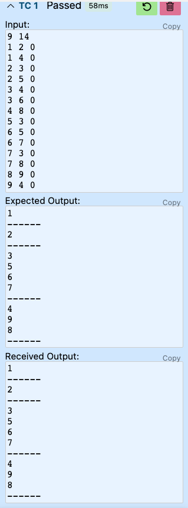

### 🤖 실습문제 15번 욕심쟁이 로봇
벨만포드 알고리즘을 사용하면 쉽게 답을 구할 수 있다. 음의 가중치가 있고 양의 가중치도 있는 상태에서 가중치의 합이 최대가 되게 하는 것이다. 이를 다르게 표현하면 벨만포드알고리즘에서 최장거리를 구하면 되는 것이다.

따라서 기존의 벨만포드에서 최단거리표가아닌 최장거리표로 작성한 뒤 모든 값을 -무한대 로 지정한다. 이 후에 벨만포드 알고리즘을 적용하는데 최장거리표를 업데이트하는 기준에 대해서 기존의 방식과 다른 방식으로 해야하며 최장거리표에 작성된 값과 가중치의 합이 인접한 정점의 최장거리표 값보다 큰 경우에 최장거리표를 업데이트 하도록 하는것이 핵심이다.

```cpp
#include <iostream>
#include <vector>
#include <list>
#include <numeric>

class Edge {
public:
   int dst;
   int weight;

   Edge(int d, int w) : dst(d), weight(w) {}
};

class Graph {
public:
   int size;
   std::vector<std::list<Edge>> G;

   Graph(int s) : size(s) {
      G.resize(s);
   }

   void addEdge(int s, int d, int w) {
      G[s].push_back(Edge(d, w));
   }
};

void bellmanFord(Graph& g) {
   std::vector<int> distance(g.size, std::numeric_limits<int>::min());
   distance[0] = 0;
   for(int j = 0; j < g.size - 1; j++) {
      for(int i = 0; i < g.size; i++) {
         for(auto& e : g.G[i]) {
            if(distance[i] != std::numeric_limits<int>::min() &&
               distance[i] + e.weight > distance[e.dst]
            ) {
               distance[e.dst] = distance[i] + e.weight;
            }
         }
      }
   }

   bool isCycled = false;

   for(int i = 0; i < g.size; i++) {
      for(auto& e : g.G[i]) {
         if(distance[i] != std::numeric_limits<int>::min() &&
            distance[i] + e.weight > distance[e.dst]
         ) {
            isCycled = true;
            break;
         }
      }
      if(isCycled) {
         break;
      }
   }
   
   if(isCycled) {
      std::cout << "탐색 중단";
   } else {
      std::cout << distance[g.size - 1];
   }
   
   
}

int main(void) {
   using namespace std;

   int N; ///가로 세로 길이
   string tmp;
   int tw;

   cin >> N;

   Graph g(N * N);

   
   
   for(int i = 0; i < N * N - 1; i++) {
      cin >> tmp >> tw;
      
      while(tmp != "") {
         switch(tmp.back()) {
            case 'N':
               g.addEdge(i, i - N, tw);
               break;
            case 'S':
               g.addEdge(i, i + N, tw);
               break;
            case 'E':
               g.addEdge(i, i + 1, tw);
               break;
            case 'W':
               g.addEdge(i, i - 1, tw);
               break;
         }
         tmp.pop_back();
      }
   }

   bellmanFord(g);


   return 0;
}
```

여러 테스트 케이스를 거쳐 검증하였다.

<hr>


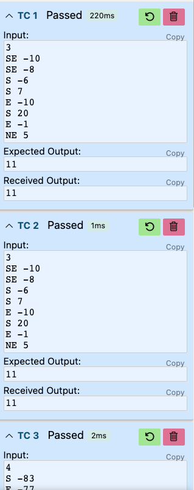


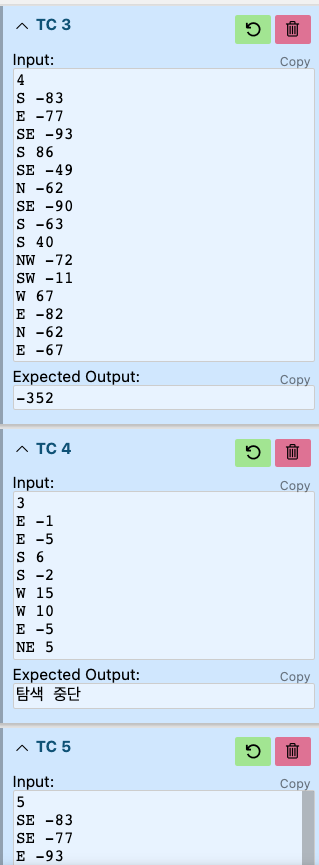


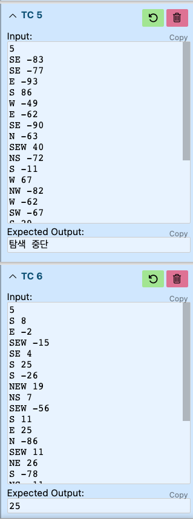


### 🛸 미로-순간이동 게임
```cpp
#include <cstdio>
#include <vector>
#include <list>
#include <numeric>
#include <algorithm>
#include <stack>
#include <set>

class Edge {
public:
   int dst;
   int weight;

   Edge(int d, int w) : dst(d), weight(w) {}
};

class Graph {
public:
   int size;
   std::vector<std::list<Edge>> G;

   Graph(int s) : size(s) {
      G.resize(s);
   }

   void addEdge(int s, int d, int w) {
      G[s].push_back(Edge(d, w));
   }

   Graph transp() {
      Graph ret(size);
      for (int i = 0; i < size; i++) {
         for (auto& adj : G[i]) {
               ret.addEdge(adj.dst, i, adj.weight);
         }
      }
      return ret;
   }
};

void DFS_for_seq_recursive(Graph& g, std::stack<int>& seq, std::vector<int>& visited, int cur) {
   visited[cur] = 1;

   for(auto& e: g.G[cur]) {
      if(visited[e.dst] == 0) {
         DFS_for_seq_recursive(g, seq, visited, e.dst);
      }
   }
   seq.push(cur);
}

std::stack<int> DFS_for_seq(Graph& g) {
   std::vector<int> visited(g.size, 0);
   std::stack<int> seq;
   for(int i = 0; i < g.size; i++) {
      if(visited[i] == 0) {
         DFS_for_seq_recursive(g, seq, visited, i);
      }
   }

   return seq;
}

void DFS_for_SCC_recursive(Graph& g, std::vector<int>& visited, int cur, std::vector<int>& cc) {
   visited[cur] = 1;
   cc.push_back(cur);

   for(auto& e: g.G[cur]) {
      if(visited[e.dst] == 0) {
         DFS_for_SCC_recursive(g, visited, e.dst, cc);
      }
   }
}

void DFS_for_SCC(Graph& g, std::stack<int>& seq) {
   std::vector<int> visited(g.size, 0);

   while(!seq.empty()) {
      std::vector<int> cc;
      if(visited[seq.top()] == 0) {
         DFS_for_SCC_recursive(g, visited, seq.top(), cc);
      }

      bool isWC = true;

      Graph tranp = g.transp(); ///원본 그래프
      for(auto& a: cc) {
         for(auto& e: tranp.G[a]) {
            if(std::find(cc.begin(), cc.end(), e.dst) == cc.end()) {
               isWC = false;
               break;
            }
         }

         if(!isWC) {
            break;
         }
      }

      if(isWC && !cc.empty()) {
         for(auto& a: cc) {
            printf("%d ", a);
         }
         printf("\n");
      }
      
      seq.pop();
   }
}

void kosaraju(Graph& g) {
   std::stack<int> seq = DFS_for_seq(g);
   Graph tranp = g.transp();
   DFS_for_SCC(tranp, seq);
}

void mazeRunner(Graph& g) {
   bool isCycled = false;
   std::vector<int> score(g.size, std::numeric_limits<int>::max());
   for(int i = 0; i < g.size; i++) {
      std::vector<int> distance(g.size, std::numeric_limits<int>::max());
      distance[i] = 0;
      for(int j = 0; j < g.size - 1; j++) {
         for(int i = 0; i < g.size; i++) {
            for(auto& e : g.G[i]) {
               if(distance[i] != std::numeric_limits<int>::max() &&
                  distance[i] + e.weight < distance[e.dst]
               ) {
                  distance[e.dst] = distance[i] + e.weight;
               }
            }
         }
      }

      for(int i = 0; i < g.size; i++) {
         for(auto& e : g.G[i]) {
            if(distance[i] != std::numeric_limits<int>::max() &&
               distance[i] + e.weight < distance[e.dst]
            ) {
               isCycled = true;
               break;
            }
         }
         if(isCycled) {
            break;
         }
      }
      
      if(isCycled) {
         printf("유효하지 않은 미로");
         return;
      } else {
         int tmp = std::numeric_limits<int>::max();
         for(auto& a: distance) {
            if(a != 0) {
               tmp = a < tmp ? a : tmp;
            }
         }

         score[i] = tmp;
      }
   }
   for(int i = 0; i < g.size; i++) {
      if(score[i] == std::numeric_limits<int>::max()) {
         printf("%d: 고립된 방\n", i);
      } else {
         printf("%d: %d\n", i, score[i]);
      }
   }

   kosaraju(g);

}

int main(void) {
   using namespace std;

   int vn, en;

   scanf("%d %d", &vn, &en);

   Graph g(vn);

   int st, dst, weight;
   for (int i = 0; i < en; i++) {
      scanf("%d %d %d", &st, &dst, &weight);
      g.addEdge(st, dst, weight);
   }

   mazeRunner(g);

   // Graph tr_g = g.transp();

   // std::stack<int> seq = DFS(g);

   // kosaraju(seq, tr_g);

   return 0;
}
```
### 교재에 있는 테스트 케이스 적용

<hr>

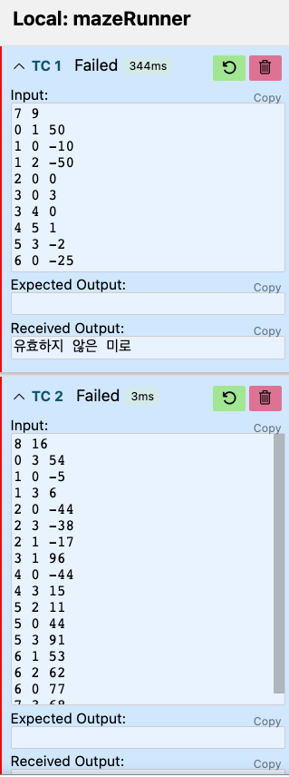


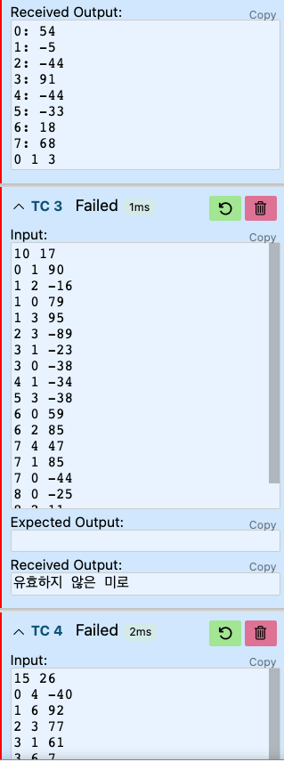


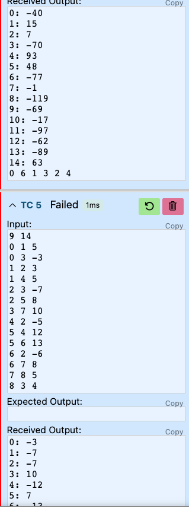

