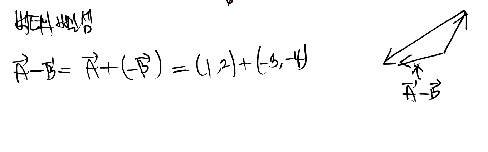
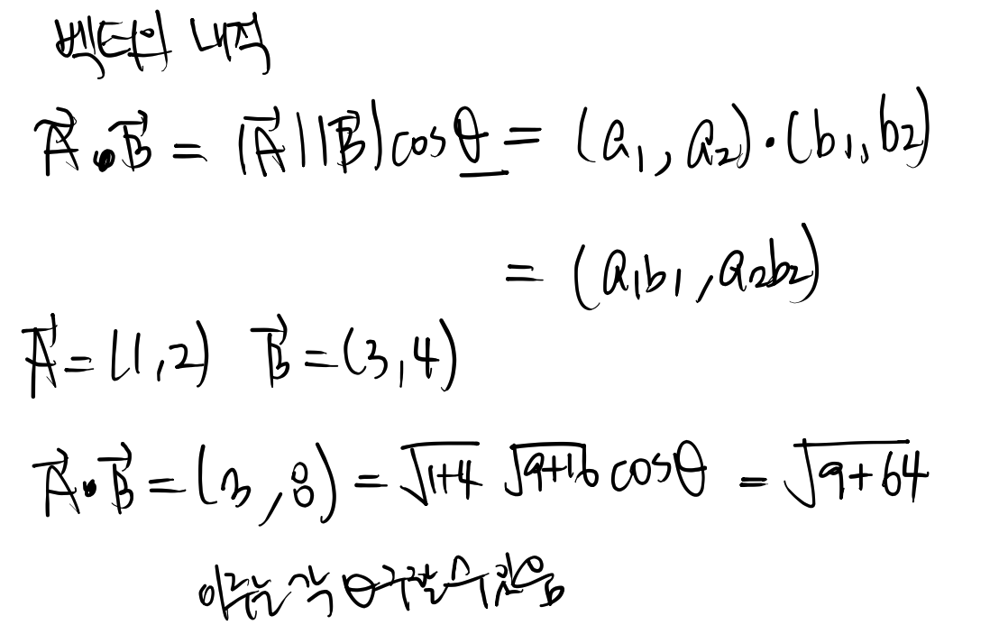
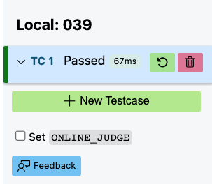
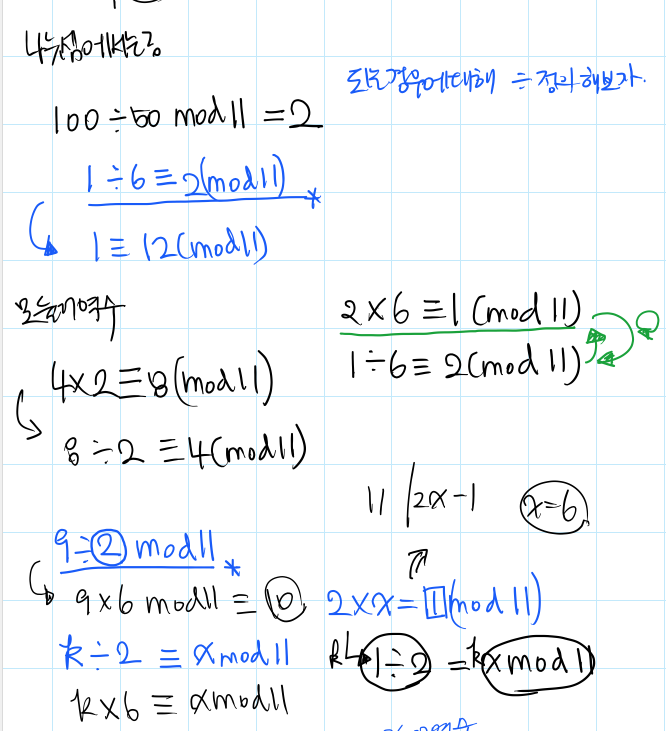

### 1. 계산기하학

#### 벡터
벡터는 두점의 상대적인 위치를 표현하기 위해 사용하는 것이다.







예제 : 점과 선분의 거리
```javascript
#include <iostream>
#include <cmath>
using namespace std;

struct pos {
   double x, y;

   pos(double X = 0, double Y = 0) : x(X), y(X) {};

   pos operator+(pos p) {
      return pos(x + p.x, y + p.y);
   }

   pos operator-(pos p) {
      return pos(x - p.x, y - p.y);
   };

   double operator*(pos p) {
      return x * p.x + y + p.y;
   };

   double operator/(pos p) {
      return x * p.y - y * p.x;
   };

   double abs() {
      return sqrt(pow(x, 2) + pow(y, 2));
   }

   pos inv() {
      return pos(-x, -y);
   }
};

int main(void) {
   pos A, B, C;

   cin >> A.x >> A.y;
   cin >> B.x >> B.y;
   cin >> C.x >> C.y;

   pos AB, BC, CA;
   AB = B - A;
   BC = C - B;
   CA = A - C;

   if(AB.inv() * BC < 0) {
      ///BA * BC 가 음수면 AB
      cout << AB.abs();
   } else if(BC.inv() * CA < 0) {
      ///CB * CA 가 음수
      cout << CA.abs();
   } else {
      ///d = (BA / BC) / BC
      cout << (AB.inv() / BC) / BC.abs();
   }
   

   return 0;
}
```

연습문제 1

연습문제 2
2차원 평면에 n개의 점이 있고 i 번째 점은 (xi,yi)이다.
가장 가까운 두 점의 거리를 구하는 프로그램을 작성하라.

```cpp
#include <iostream>
#include <vector>
#include <cmath>
using namespace std;

struct pos {
   int x;
   int y;

   pos(int X = 0, int Y = 0) : x(X), y(Y) {};

   double getDistance(pos p) {
      return sqrt(pow(x - p.x, 2) + 
      pow(y - p.y, 2));
   }
};

int main(void) {
   int n;
   int x, y;
   cin >> n;
   vector<pos> p(n);
   double d = 10e5;
   for(int i = 0; i < n; i++) {
      cin >> x >> y;
      p[i] = pos(x, y);
   }

   for(int i = 0; i < n - 1; i++) {
      for(int j = i + 1; j < n; j++) {
         if(p[i].getDistance(p[j]) < d) {
            d = p[i].getDistance(p[j]);
         }
      }
   }

   cout << d;

   return 0;
}
```

연습문제 4.1.3
2차원 평면에 원 2개가 있다 5가지의 위치관계가 존재하는데 어떤 위치관계인지 번호 표시 프로그램 작성
1. 한 원이 다른 원을 완전히 포함하며, 두 원이 접하지 않는 경우
2. 한 원이 다른 원을 완전히 포함하며, 두 원이 접한 경우
3. 두 원이 서로 교차하는 경우
4. 두 원 내부에 공통 부분이 없지만, 두 원이 접하는 경우
5. 두 원 내부에 공통 부분이 없으며 두 원이 접하지도 않는 경우


코드
```cpp
#include <iostream>
#include <vector>
#include <cmath>

using namespace std;

struct pos {
   int x;
   int y;

   pos(int X, int Y) : x(X), y(Y) {}
   double getDistance(pos p) {
      return sqrt(
         pow(x - p.x, 2) + pow(y - p.y, 2)
      );
   }
};

struct c {
   int x;
   int y;
   int r;

   c(int X = 0, int Y = 0, int R = 0) : 
   x(X), y(Y), r(R) {}

   pos retPos() {
      return pos(x, y);
   }
};

int sol(vector<c>& circles) {
   pos c1 = pos(
      circles[0].retPos()
   );
   int r1 = circles[0].r;

   pos c2 = pos(
      circles[1].retPos()
   );
   int r2 = circles[1].r;

   if(c1.getDistance(c2) < min(r1, r2)) {
      return 1;
   } else if(c1.getDistance(c2) == min(r1, r2)) {
      return 2;
   } else if(c1.getDistance(c2) < r1 + r2) {
      return 3;
   } else if(c1.getDistance(c2) == r1 + r2) {
      return 4;
   } else {
      return 5;
   }
}


int main(void) {
   int x, y, r;
   
   vector<c> circles(2);

   for(int i = 0; i < 2; i++) {
      cin >> x >> y >> r;
      circles[i] = c(x, y, r);
   }

   cout << sol(circles);

   return 0;
}
```

연습문제 4.1.4
시침의 길이가 A, 분침의 길이가 B인 시계가 있다.
H시 M분이 되었을 때 두 바늘 끝은 몇 cm인가

```cpp
#include <iostream>
#include <cmath>

using namespace std;

struct p {
   double x;
   double y;
   p (int d, int t, char a, int m = 0) {
      const double M = a == 'H' ? 30 : 6;
      x = d * cos((90 - M * t + (90 - 6 * m) * 1 / 12) * M_PI / 180);
      y = d * sin((90 - M * t + (90 - 6 * m) * 1 / 12) * M_PI / 180);
   }

   double getDistance(p p1) {
      return sqrt(pow(x - p1.x, 2) + pow(y - p1.y, 2));
   }
};

int main(void) {
   int A, B, H, M;

   cin >> A >> B >> H >> M;

   p p1(A, H, 'H', M);
   p p2(B, M, 'M');

   cout << p1.x << " " << p1.y << '\n';
   cout << p2.x << " " << p2.y << '\n';

   cout << p1.getDistance(p2);

   return 0;
}
```

연습문제 4.1.5
4개의 좌표주어지고 처음부터 2개의 좌표씩 묶어서 선분을 만듬 두 선분이 교차하는지 판정하는 프로그램 작성하시오

```cpp
#include <iostream>
#include <vector>
using namespace std;

struct c {
   double a;
   double b;

   c(int A, int B) : a(A), b(B) {}
};

struct pos {
   int x;
   int y;

   pos(int X = 0, int Y = 0) : x(X), y(Y) {}

   c getC(pos p1) {
      double a = (p1.y - y) / (p1.x - x);
      return c(a, y - a * x);
   }
};

bool sol(vector<pos>& ps) {
   c c1 = ps[0].getC(ps[1]);
   c c2 = ps[2].getC(ps[3]);

   if(c1.a - c2.a == 0) {
      return 0;
   } else {
      double x = (c2.b - c1.b) / (c1.a - c2.a);

      if(ps[0].x <= x && x <= ps[1].x &&
         ps[2].x <= x && x <= ps[3].x
      ) {
         return 1;
      } else {
         return 0;
      }
   }
}

int main(void) {

   vector<pos> ps(4);

   for(int i = 0; i < 4; i++) {
      cin >> ps[i].x;
      cin >> ps[i].y;
   }

   cout << (sol(ps) ? "Yes" : "No");

   return 0;
}
```

예제 038
누적합은 이전 누적합에 다음 값을 더하여 시간복잡도를 줄일 수 있다. 또한 어느 부분과 어느부분사이에 누적은 전체의 누적합을 통해 구할 수 있으며

```cpp
s[i] = s[i - 1] + n[i];
```
로 구할 수 있다.

누적합의 배열을 s라하고 시점 b와 e사이의 누적합을 구할 때
```cpp
s[i] = s[e - 1] - s[b - 2];
```
로 구할 수 있다.


```cpp
#include <iostream>
#include <vector>
using namespace std;

int main(void) {
   int N, D;
   cin >> N >> D;

   vector<int> n(N);
   vector<int> s(N);
   for(int i = 0; i < N; i++) {
      cin >> n[i];
   }

   s[0] = n[0];

   for(int i = 1; i < N; i++) {
      s[i] = s[i - 1] + n[i];
   }

   int b, e;

   for(int i = 0; i < D; i++) {
      cin >> b >> e;
      cout << s[e - 1] - s[b - 2] << '\n';
   }

   return 0;
}
```

039

N개의 지역으로 구분되어있는 나라, 서쪽 부터 차례대로 1부터 N까지 번호붙어있음
처음에는 어떤지역도 눈이 안 쌓여있음. Q일동안 각 지역에 눈이 쌓였음 i번째 날 Li ... Ri에 Xi만큼 눈이 쌓일 것으로 예상됨

눈이 모두 내린 후에 눈이 얼마나 쌓였는지 대소관계 나타내야함

```cpp
#include <iostream>
#include <vector>
using namespace std;


int main(void) {
   int N, x;
   int l, r, h;

   cin >> N >> x;

   vector<int> s(N, 0);

   for(int i = 0; i < N; i++) {
      cin >> l >> r >> h;

      for(int i = l - 1; i < r; i++) {
         s[i] += h;
      }
   }

   for(int i = 0; i < N - 1; i++) {
      if(s[i] < s[i + 1]) {
         cout << '<';
      } else if(s[i] > s[i + 1]) {
         cout << '>';
      } else {
         cout << '=';
      }
   }

   return 0;
}
```




4.2.1
철도회사 1호선 N개의 역이있음, 서쪽부터 1...N임
각 역은 양방향을 연결되어있음 거리는 Ai미터임. 철수가 B1에서 역 Bm으로 가는 여행 계획을 세웠음 여행하면서 전체 몇 미터 이동하는지 구하시오.

```cpp
#include <iostream>
#include <cmath>
#include <vector>
using namespace std;

int main(void) {
   int N, n, d;
   int pd = 1;


   cin >> N;


   vector<int> s(N);

   for(int i = 0; i < N - 1; i++) {
      cin >> s[i];
   }

   // s[i] => i에서 i + 1로가는 거리
   int r = 0;


   cin >> n >> pd;
   
   for(int j = 0; j < n; j++) {
      cin >> d;

      if(pd < d) {
         for(int k = pd; k < d; k++) {
            r += s[k - 1]; // Corrected indexing
         }
      } else {
         for(int k = d; k < pd; k++) {
            r += s[k - 1]; // Corrected indexing
         }
      }

      pd = d;
   }

   cout << r;

   return 0;
}
```


4.2.2
t = 0...T - 1, t + 0.5에 있는 직원의 수 출력
l r사이에 존재함

```cpp
#include <iostream>
using namespace std;

int main(void) {
   int T, N, l, r;
   cin >> T >> N;

   vector<int> t(T, 0);

   for(int i = 0; i < N; i++) {
      cin >> l >> r;

      for(int i = l; i < r; i++) {
         t[i] += 1;
      }
   }

   for(int i = 0; i < T; i++) {
      cout << t[i] << '\n';
   }

   return 0;
}
```

#### 뉴턴법


4.3.2 세제곱 루트 2

```cpp
#include <iostream>
#include <cmath>
using namespace std;

int main(void) {
   double a = 2.0;
   double x = 2.0, y = pow(x, 3);
   
   for(int i = 0; i < 5; i++) {
      x = (2. / 3.) * a + 2. / (3. * pow(a, 2));
      y = pow(x, 3);
      a = x;
   }

   cout << a;

   return 0;
}
```

4.3.3
루트2 이진 탐색을 풀기

```cpp
#include <iostream>
#include <cmath>
using namespace std;

int main(void) {
   double l = 1.0, r = 2.0;
   double m;
   for(int i = 0; i < 50; i++) {
      m = (l + r) / 2;
      if(pow(m, 2) < 2) {
         l = m;
      } else {
         r = m;
      }

      cout << i + 1 << " : " << m << '\n';
   }

   cout << m;


   return 0;
}
```


뉴턴법은 시간복잡도가 O(1)이고 이진탐색법은 O(logn)이다.

#### 에라토스테네스의 체


```cpp
#include <iostream>
#include <cmath>
using namespace std;

int main(void) {
   int N;

   cin >> N;
   vector<int> p(N + 1, 1);

   for(int i = 2; pow(i, 2) < N; i++) {
      if(p[i] == 1) {
         for(int j = 2 * i; j < N; j = j + i) {
            p[j] = 0;
         }
      }
   }

   for(int i = 2; i < N + 1; i++) {
      if(p[i] == 1) {
         cout << i << '\n';
      }
   }

   return 0;
}
```

에라토스테네스의 체는 시간복잡도가 O(nlogn)이라고 하는데 이는 적분을 통해서 복잡도를 구할 수 있다.


```cpp
#include <iostream>
#include <cmath>
using namespace std;

int main(void) {
   int N;

   cin >> N;
   vector<int> p(N + 1, 1);

   for(int i = 2; i < N + 1; i++) {
      p[i] += 1;
      for(int j = 2 * i; j < N + 1; j = j + i) {
         p[j] += 1;
      }
   }

   long long r = 0;

   for(int i = 1; i < N + 1; i++) {
      r += i * p[i];
   }

   cout << r;

   return 0;
}
```

4.4.4
1/2 + ... 1/n이 30을 넘게 되는 n을 계산하시오


```cpp
#include <iostream>
using namespace std;

int main(void) {
   int i = 1;
   double r = 0;

   while(r <= 20) {
      r += 1.0 / (i + 1);
      i += 1;
   }

   cout << i - 1;

   return 0;
}

```

이 문제는 i가 30이면 겁나 오래걸림;;


(나머지 이야기)





피보나치 수열 나머지 구하기
```cpp
#include <iostream>
using namespace std;

int m[10000000 + 1];

int main(void) {
   m[1] = 1;
   m[2] = 1;

   int N;
   cin >> N;

   if(N < 3) {
      cout << 1;
      return 0;
   } else {
      for(int i = 3; i < N + 1; i++) {
         m[i] = (m[i - 1] + m[i - 2]) % 1000000007;
      }
   }

   cout << m[N];

   return 0;
}
```


a의 b제곱과 나머지

```cpp
#include <iostream>
using namespace std;

int main(void) {
   int a, b;
   long ret = 1;

   cin >> a >> b;

   for(int i = 0; i < b; i++) {
      ret = (ret * a) % 1000000007;
   }

   cout << ret;

   return 0;
}
```


개선된 코드

```cpp
#include <iostream>
using namespace std;

int main(void) {

   int a, b, M, ret = 1;
   
   cin >> a >> b >> M;

   long long p = a;

   for(int i = 0; i < b; i++) {
      if(b & (1LL << i)) {
         ret = (ret * p) % M;
      }
      p = (p * p) % M;
   }

   cout << ret;

   return 0;
}
```

b를 이진수 변환하여 1인 경우 p를 answer에 곱하고 모듈러 연산 수행
각 반복마다 p는 제곱하여 갱신된다.

경로의 경우의 수문제
X, Y -> (X + Y) C Y

```cpp
#include <iostream>
using namespace std;

int pow_m(int a, int b, int M) {
    long long p = a;
    int res = 1;

    for (; b > 0; b >>= 1) {
        if (b & 1) {
            res = (res * p) % M;
        }
        p = (p * p) % M;
    }

    return res;
}

int main(void) {
    int X, Y;
    cin >> X >> Y;

    int M = 1000000007;

    long ans = 1;

    int a = 1, b = 1; // a는 분자, b는 분모

    for (int i = 2; i < X + Y + 1; i++) {
        a = (a * i) % M;
    }

    for (int i = 2; i < X + 1; i++) {
        b = (b * i) % M;
    }

    for (int i = 2; i < Y + 1; i++) {
        b = (b * i) % M;
    }

    // Calculate the modular inverse of b
    int b_inv = pow_m(b, M - 2, M);

    cout << ((long long)a * b_inv) % M;

    return 0;
}
```

4.6.1

```cpp
#include <iostream>
using namespace std;

int main(void) {
   int M = 20;
   int a[6] = {21, 41, 61, 81, 101, 121};
   int r = 1;

   for(int i = 0; i < 6; i++) {
      r = (r * (a[i] % M)) % M;
   }

   cout << r << '\n';

   int M1 = 100;

   int b = 202112;
   b = b % 100;
   r = 1;
   for(int i = 0; i < 5; i++) {
      r = (r * b) % 100;
   }

   cout << r;

   return 0;
}
```

4.6.2 나이트의 이동
```cpp
#include <iostream>
using namespace std;

const int MOD = 1000000007;

long long pow_m(long long a, long long b) {
    long long result = 1;
    while (b > 0) {
        if (b % 2 == 1)
            result = (result * a) % MOD;
        a = (a * a) % MOD;
        b /= 2;
    }
    return result;
}

int main(void) {
    int X, Y;
    cin >> X >> Y;

    int M = (2 * X - Y) / 3;
    int N = (2 * Y - X) / 3;

    long long t = 1, d = 1;
    for (int i = 1; i < M + N + 1; i++) {
        t = (t * i) % MOD;
    }

    for (int i = 1; i <= M; i++) {
        d = (d * i) % MOD;
    }

    for (int i = 1; i <= N; i++) {
        d = (d * i) % MOD;
    }
    
    if (M + 2 * N == X) {
        cout << ((long long)t * pow_m(d, MOD - 2)) % MOD;
    } else {
        cout << 0;
    }

    return 0;
}


```


4.6.3 공비가 4인 수열의 합을 1000000007로 나눈 나머지를 구하라

```cpp
#include <iostream>
using namespace std;

const int MOD = 1000000007;

long long pow_m(long long a, long long b) {
    long long result = 1;
    while (b > 0) {
        if (b % 2 == 1)
            result = (result * a) % MOD;
        a = (a * a) % MOD;
        b /= 2;
    }
    return result;
}

int main(void) {
   int N;

   cin >> N;

   long long ans = ((pow_m(4, N + 1) - 1) * pow_m(3, MOD - 2)) % MOD;

   cout << ans;


   return 0;
}
```


피보나치 수열의 9번째 자리수까지 구하기(행렬 이용)
```cpp
#include <iostream>
using namespace std;

const int MOD = 1000000000;

struct MAT {
   long long a[2][2];

   MAT(long long a11, long long a12, long long a21, long long a22) {
      a[0][0] = a11;
      a[0][1] = a12;
      a[1][0] = a21;
      a[1][1] = a22;
   }

   MAT operator*(MAT m) {
      long long c[2][2] = {{0, 0}, {0, 0}};

      for(int i = 0; i < 2; i++) {
         for(int j = 0; j < 2; j++) {
            for(int k = 0; k < 2; k++) {
               c[i][j] += (a[i][k] * m.a[k][j]) % MOD;
               c[i][j] %= MOD;
            }
         }
      }
      return MAT(c[0][0], c[0][1], c[1][0], c[1][1]);
   }
};


int main(void) {
   MAT st = MAT(1, 1, 1, 0);

   long long N;
   cin >> N;
   N = N - 2;

   MAT p = st;
   MAT ans = st;
   
   while(N > 0) {
      if(N % 2 != 0) {
         ans = ans * p;
      }
      p = p * p;

      N = N >> 1;
   }

   cout << (ans.a[1][0] + ans.a[1][1]) % MOD << '\n';

   return 0;
}
```


점화식 An = 2 * An-1 + An-2에서 N번째 항을 1000000007로 나눈 나머지 구하라
```cpp
#include <iostream>
using namespace std;

const int MOD = 1000000007;

struct MAT {
   long long a[2][2];

   MAT(long long a11, long long a12, long long a21, long long a22) {
      a[0][0] = a11;
      a[0][1] = a12;
      a[1][0] = a21;
      a[1][1] = a22;
   }

   MAT operator*(MAT m) {
      long long c[2][2] = {{0, 0}, {0, 0}};

      for(int i = 0; i < 2; i++) {
         for(int j = 0; j < 2; j++) {
            for(int k = 0; k < 2; k++) {
               c[i][j] += (a[i][k] * m.a[k][j]) % MOD;
               c[i][j] %= MOD;
            }
         }
      }
      return MAT(c[0][0], c[0][1], c[1][0], c[1][1]);
   }
};


int main(void) {
   MAT st = MAT(2, 1, 1, 0);

   long long N;
   cin >> N;
   N = N - 2;

   MAT p = st;
   MAT ans = st;
   
   while(N > 0) {
      if(N % 2 != 0) {
         ans = ans * p;
      }
      p = p * p;

      N = N >> 1;
   }

   cout << (ans.a[1][0] + ans.a[1][1]) % MOD << '\n';

   return 0;
}
```


A1 = 1, A2 = 1, A3 = 2
An = An-1 + An-2 + An-3

```cpp
#include <iostream>
using namespace std;

const int MOD = 1000000007;

struct MAT {
    long long a[3][3];

    MAT(long long a11, long long a12, long long a13,
        long long a21, long long a22, long long a23,
        long long a31, long long a32, long long a33) {
        a[0][0] = a11; a[0][1] = a12; a[0][2] = a13;
        a[1][0] = a21; a[1][1] = a22; a[1][2] = a23;
        a[2][0] = a31; a[2][1] = a32; a[2][2] = a33;
    }

    MAT operator*(const MAT &m) const {
        MAT result(0, 0, 0, 0, 0, 0, 0, 0, 0);
        for(int i = 0; i < 3; i++) {
            for(int j = 0; j < 3; j++) {
                for(int k = 0; k < 3; k++) {
                    result.a[i][j] += (a[i][k] * m.a[k][j]) % MOD;
                    result.a[i][j] %= MOD;
                }
            }
        }
        return result;
    }
};

int main(void) {
   MAT st = MAT(1, 1, 1, 1, 0, 0, 0, 1, 0);

   long long N;
   cin >> N;
   
   N = N - 2;

   MAT p = st;
   MAT ans = st;
   
   while(N > 0) {
      if(N % 2 != 0) {
         ans = ans * p;
      }
      p = p * p;

      N = N >> 1;
   }

   cout << ans.a[0][0];


   return 0;
}
```


