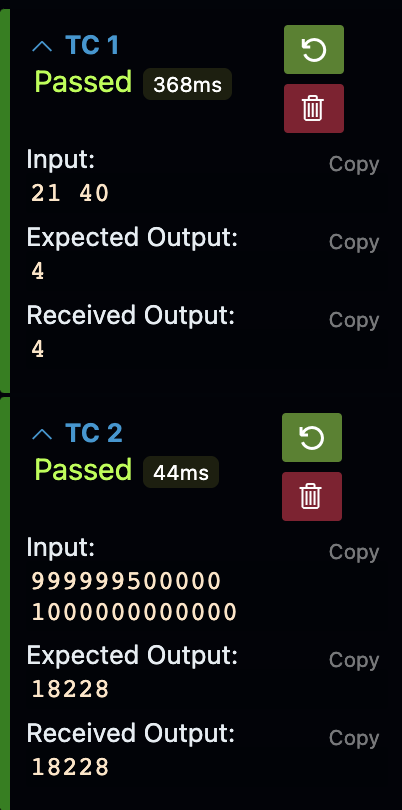

# 문제해결을 위한 알고리즘 with 수학

## 최종확인 문제

### 23번

정수 L과 R이 주어집니다. L이상 R이하의 소수 개수를 구하는 프로그램을 작성해 주세요. 

$L \leq R \leq 10^{12}$

$R - L \leq 500000$ 을 만족하는 입력에서 1초 이내에 실행을 종료할 수 있게 코드를 구성해주세요


#### 입출력 예시


#### 설명
기존의 에라토스테네스의 체는 2부터 시작하여, 각 숫자의 배수를 모두 지워나가면서 소수를 찾는 방식이다. 하지만 23번 문제는 R과 L이 충분히 크므로 기존의 방식으로 해결할 수 없다.

따라서 배열을 $L \leq t \leq R$사이 즉 $R - L + 1$개 만큼의 원소를 할당하여 $L \leq t \leq R$ 수 중 2부터 시작하여 각 숫자의 배수를 모두 지워나가면서 소수를 찾아야한다.


$L$이상의 수중에서 가장 작은 $i$ 의 배수를 찾아 $i$ 를 더하면서 수를 지워나간다. 
$m = t \times i \quad (L \leq m \leq R)$


하지만 $L$ 이상의 수가 $2$ 나 $3$ 등 소수인 경우를 제외해야하므로 $i$ 와 $m$이 같은 경우 지우지 않는다.


#### 전체 코드

```cpp
#include <iostream>
#include <vector>
using namespace std;

void sol(vector<int>& n, long long L, long long R) {
   if(L == 1) {
      n[0] = 0;
   }

   for(long long i = 2; i * i <= R; i++) {
      long long min_value = ((L + i - 1) / i) * i;

      for(long long j = min_value; j <= R + 1; j = j + i) {
         if(j == i) {
            continue;
         }

         n[j - L] = 0;
      }
   }

   int c = 0;
   for(long long i = 0; i < R - L + 1; i++) {
      if(n[i] == 1) {
         c++;
      }
   }

   cout << c;
}

int main(void) {
   long long L, R;
   cin >> L >> R;

   vector<int> n(R - L + 1, 1);

   sol(n, L, R);

   return 0;
}
```

#### 출력


#### 설명

1. 입력값의 범위를 반영하여 변수 타입 정하기
   $R$ 은 $10^{12}$까지의 수를 받을 수 있어야 하므로 $long long$ 타입으로 지정한다.

   ```cpp
   long long L, R;
   ```

2. $L$부터 $R$까지의 수가 소수인지를 기록할 벡터를 선언한다. 원소의 개수는 $R - L + 1$개이며 참을 기본값으로 해준다.
   ```cpp
   vector<int> n(R - L + 1, 1);
   ```

3. $L$이 $1$인 경우 할당한 배열에서의 [0]값이 $L$의 소수여부 이므로 거짓으로 해준다.
   ```cpp
   void sol(vector<int>& n, long long L, long long R) {
   if(L == 1) {
      n[0] = 0;
   }
   ```

4. $2$부터 시작하여 $\sqrt{R}$까지 각 숫자의 배수를 모두 지워나가면 된다.
   ```cpp
      void sol(vector<int>& n, long long L, long long R) {
      if(L == 1) {
         n[0] = 0;
      }

      for(long long i = 2; i * i <= R; i++) {
   ```

3. $L$이상 $\sqrt{R}$의 수 중에서 가장 작은 $i$의 배수를 찾는다.
   ```cpp
   long long min_value = ((L + i - 1) / i) * i;
   ```

   $L+i-1$은 i의 배수가 되기 직전의 수까지를 의미한다. $-1$을 하는 이유는 $L$이 이미 $i$의 배수인 경우를 처리하기 위함이다.

   만약 $-1$을 하지 않고 진행한다면 $t\cdot i$인 경우가 있을 수 있으며 $i$로 나누고 곱하는 과정에서 $t$가 되어 가장 작은 $i$의 배수가 $t\cdot i$가 될 것이다.
   (추가설명 아래기재)

4. $m$이 $i$와 같은 경우를 제외하고 $m$과 $m$의 배수들 모두를 지워나간다.
   ```cpp
   for(long long j = min_value; j <= R + 1; j = j + i) {
      if(j == i) {
         continue;
      }

      n[j - L] = 0;
   }
   ```

5. 카운트 후 출력
   ```cpp
   int c = 0;
   for(long long i = 0; i < R - L + 1; i++) {
      if(n[i] == 1) {
         c++;
      }
   }

   cout << c;
   ```

#### 정리
기존의 에라토스테네스의 체 문제에서는 단순히 2부터 각 숫자의 배수들을 모두 지우면 끝나는 문제였다. 하지만 23번 문제의 경우 입력의 크기가 매우크므로 2부터 지워나갈 수 없다. 이 문제에서의 핵심 부분은 $L$보다 큰 가장 작은 $i$의 배수를 찾는 과정이 아닐까 싶다.


#### chat gpt의 이야기

네, 이 부분을 설명하기 위해 여러 단계로 나누어 보겠습니다. 식의 목적은 주어진 `L` 값 이상에서 `i`의 배수 중 가장 작은 값을 찾는 것입니다. 이 식은 특히 에라토스테네스의 체 알고리즘을 변형한 범위 내에서 소수를 찾을 때 유용합니다.

### 식의 구조

이 식은 크게 두 부분으로 나눌 수 있습니다:
1. `((L + i - 1) / i)`
2. `* i`

### 첫 번째 부분: ((L + i - 1) / i)

이 부분은 `L` 이상의 가장 작은 `i`의 배수를 찾기 위한 계산 과정입니다.

- `L + i - 1`: `L`에서 시작하여 `i`의 배수가 되기 직전의 수까지를 의미합니다. 여기에 `-1`을 더하는 이유는 `L`이 이미 `i`의 배수인 경우를 처리하기 위함입니다. 이렇게 하면 `L`이 `i`의 배수일 때, 그대로 `L`을 가리키게 됩니다.
- `/ i`: 이제 `L + i - 1`을 `i`로 나눕니다. 이 연산의 목적은 `L`을 넘어서는 첫 번째 `i`의 배수가 몇 번째 `i`에 해당하는지를 찾는 것입니다. 여기서 소수점 이하는 버립니다(정수 나눗셈).

### 두 번째 부분: * i

- 이제 첫 번째 부분에서 찾은 `i`의 배수의 순서에 `i`를 곱합니다. 이것은 `L` 이상에서 `i`의 배수 중 가장 작은 실제 값을 구하는 단계입니다.

### 예시

`L=10`, `i=3`인 경우를 예로 들어봅시다.

1. `((10 + 3 - 1) / 3) = (12 / 3) = 4`
2. `4 * 3 = 12`

결과적으로 `L=10` 이상에서 `i=3`의 배수 중 가장 작은 값은 12입니다. 이는 정확히 우리가 원하는 결과입니다.

이 식의 미학은 모든 `i`에 대해 `L` 이상의 가장 작은 `i`의 배수를 효율적으로 찾을 수 있다는 데 있습니다. 이를 통해 주어진 범위 내에서 에라토스테네스의 체를 적용하여 소수를 찾는 과정에서 메모리 사용을 최소화할 수 있습니다.