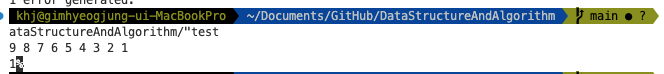
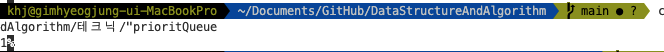

## 🍺 priority_queue 테크닉

priorty_queue의 기본 비교자는 std::less이다.
top값이 가장 작은 값이라고 생각하겠지만 가장 큰 값이며 top값을 가장 작은 값으로 하고 싶다면 std::greater를 비교자로 전달해야한다.

```cpp
#include <iostream>
#include <queue>

int main(void) {
   using namespace std;

   vector<int> v{1, 2, 3, 4, 5, 6, 7, 8, 9};
   sort(v.begin(), v.end(), greater<int>());

   for(auto a : v) {
      cout << a << " ";
   }

   cout << '\n';

   priority_queue<int, vector<int>, greater<int>> pq;
   pq.push(9);
   pq.push(8);
   pq.push(7);
   pq.push(6);
   pq.push(5);
   pq.push(4);
   pq.push(3);
   pq.push(2);
   pq.push(1);

   cout << pq.top();


   return 0;
}
```


따라서 일반적인 vector에서의 비교자사용과는 정반대이다.

### 🤔 pair를 사용한 priority_queue 활용

pair의 first값을 이용하여 비교하기 위해서는 greater의 template parameter를 수정해야한다.

```cpp
std::priority_queue<std::pair<int, int>, std::vector<std::pair<int, int>>, std::greater<std::pair<int, int>>> pq;

pq.push(make_pair(1, 2));
pq.push(make_pair(2, 2));
pq.push(make_pair(3, 2));
pq.push(make_pair(4, 2));
pq.push(make_pair(5, 2));
pq.push(make_pair(6, 2));

cout << pq.top().first;
```

